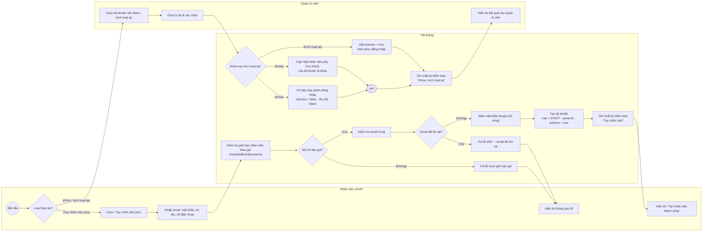
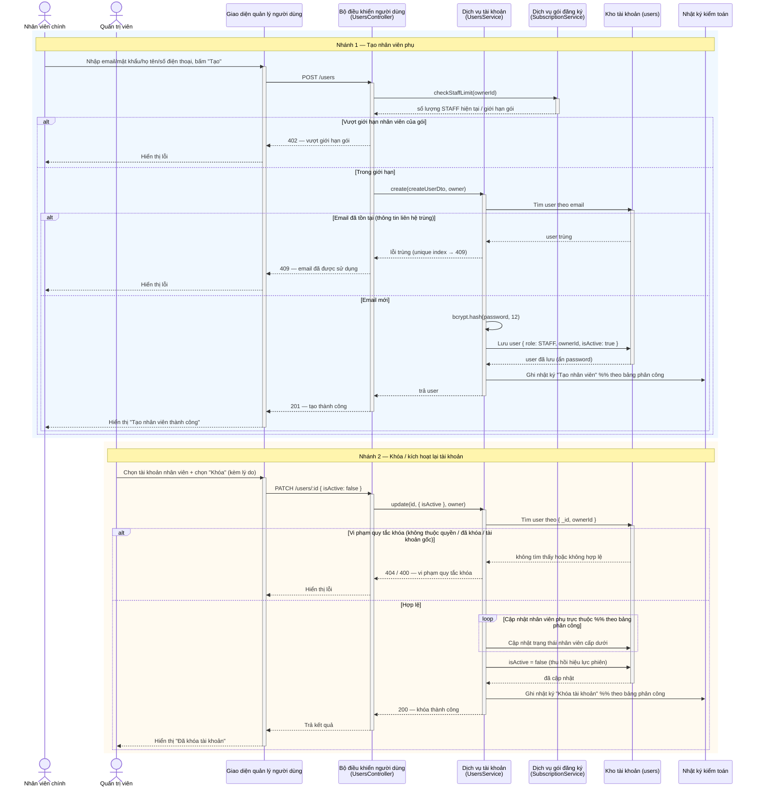
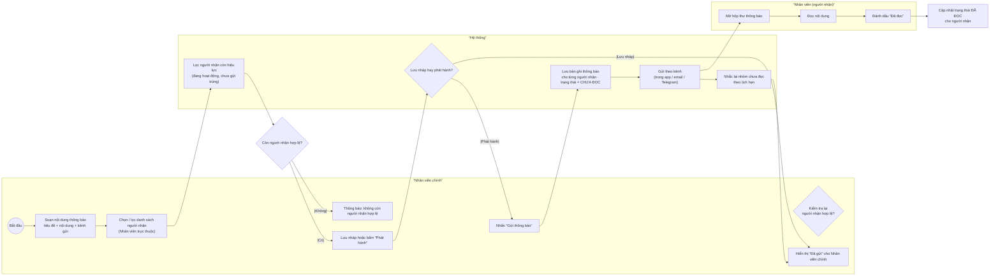
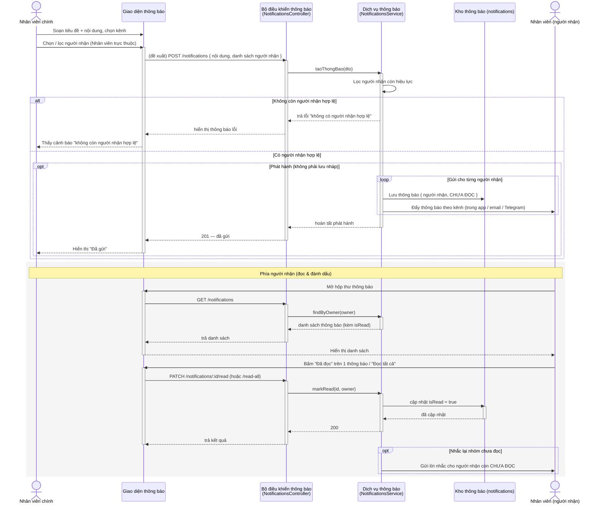
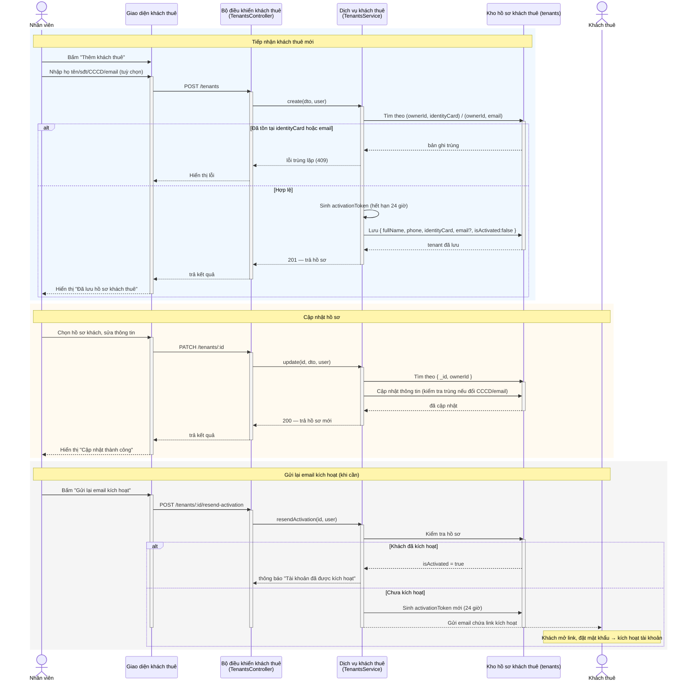
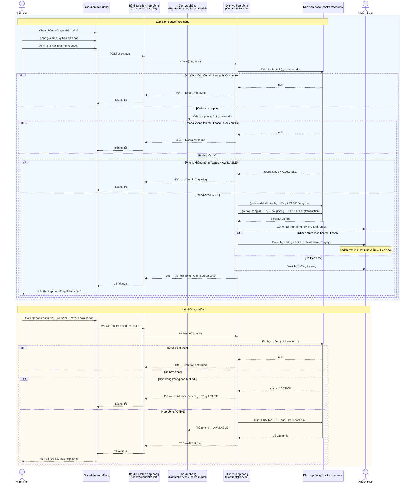

# Activity & Sequence Diagram — TV3 (Toàn) + TV5 (Thắng)

> Bản nháp **Mermaid** (8 sơ đồ: mỗi thành viên 02 Activity + 02 Sequence) — dùng để render ở
> [mermaid.live](https://mermaid.live) / VS Code / GitHub trước khi chuyển sang `.drawio` + ảnh nộp.
> Người vẽ nháp: **TV7 (Mạnh)**, đối chiếu với `doc/CLASSDIAGRAM.md` và code backend.

**Cách đọc:** Activity = `flowchart` với **swimlane** (mỗi actor/hệ thống một làn); Sequence = `sequenceDiagram`
với lifeline theo đúng danh sách *"Đối tượng tham gia"* trong bảng phân công. Mỗi đối tượng xử lý (UI/bộ điều khiển/dịch
vụ/kho) có **thanh kích hoạt** (`activate`/`deactivate`) trên lifeline thể hiện khoảng thời gian nó "sống" khi xử lý.
Dưới mỗi hình có dòng **Khớp code** ghi chú chỗ mô hình bảng phân công **lệch** với backend hiện tại, để chủ sở hữu
(TV3/TV5) tự quyết khi vẽ chính thức.

---

# TV3 (Toàn) — Gói 3: Người dùng, nhân viên và thông báo

## Hình TV3-1 · Activity Diagram — Tạo và quản lý tài khoản nhân viên (Cặp 01)

3 swimlane: **Nhân viên chính**, **Hệ thống**, **Quản trị viên**. Sau quyết định **"Loại thao tác?"** luồng tách thành
nhánh *tạo nhân viên phụ* và nhánh *khóa / kích hoạt lại tài khoản*. Nhánh khóa có **fork/join** vô hiệu hóa phiên đăng
nhập song song với cập nhật nhân viên phụ trực thuộc.

> **Khớp code:** backend chỉ cho `OWNER` tạo `STAFF` qua `POST /users` (guard `@Roles(Role.OWNER)`) — khái niệm
> *"Nhân viên chính"* của bảng phân công chưa có trong code (xem điểm rà soát **b**, CLASSDIAGRAM §10). Kiểm tra gói
> = `SubscriptionService.checkStaffLimit()` (trả 402 nếu vượt); trùng email bị khoá unique index → global filter trả **409**.
> **Fork/join "cập nhật nhân viên phụ trực thuộc" và nhật ký kiểm toán cho /users hiện chưa có trong code** — nếu giữ
> theo đúng mô tả bảng phân công thì Toàn cần thêm; nếu vẽ đúng code thì bỏ 2 ô đó (chỉ còn `isActive = false`).

## Hình TV3-2 · Sequence Diagram — Tạo và quản lý tài khoản nhân viên (Cặp 01)

Đối tượng tham gia (theo bảng phân công): **giao diện quản lý người dùng · bộ điều khiển người dùng · dịch vụ tài khoản ·
kho tài khoản · nhật ký kiểm toán**. Có `alt` cho thông tin liên hệ đã tồn tại, `alt` cho vi phạm quy tắc khóa và `loop`
cập nhật nhân viên phụ trực thuộc.

> **Khớp code:** như trên — `KHO` + `GOI` + `SV` tồn tại; **`LOG` và `loop` nhân viên trực thuộc không có trên route
> /users** (AuditInterceptor chỉ gắn ở bills/payments/contracts). Giữ hay bỏ tuỳ Toàn chốt theo bảng phân công.

## Hình TV3-3 · Activity Diagram — Tạo và gửi thông báo tới nhân viên (Cặp 02)

3 swimlane: **Nhân viên chính**, **Hệ thống**, **Nhân viên**. Luồng: soạn nội dung → lọc người nhận → lưu nháp →
phát hành → gửi theo kênh → cập nhật trạng thái đã đọc → nhắc lại nhóm chưa đọc.

> **Khớp code:** module thông báo backend hiện **chỉ có đọc / đánh dấu đã đọc** (`GET /notifications`,
> `PATCH /notifications/:id/read`, `PATCH /notifications/read-all`), **chưa có endpoint soạn/phát hành/gửi** — thông báo
> thực tế được sinh bởi cron/sự kiện và đẩy qua Telegram/email. Vì vậy Hình TV3-3/4 mô tả đúng **Use Case tạo thông báo**
> của bảng phân công nhưng chưa có bên code; Toàn cần đánh dấu rõ đây là luồng đề xuất.

## Hình TV3-4 · Sequence Diagram — Tạo và gửi thông báo tới nhân viên (Cặp 02)

Đối tượng tham gia (theo bảng phân công): **giao diện thông báo · bộ điều khiển thông báo · dịch vụ thông báo ·
kho thông báo · Nhân viên**. Có `opt` phát hành, `alt` không còn người nhận hợp lệ, `loop` gửi cho từng người nhận và
`opt` nhắc lại.

> **Khớp code:** phần đọc/đánh dấu đã đọc đúng code; phần **soạn/phát hành/loop gửi/nhắc lại là đề xuất** theo Use Case
> (chưa có endpoint tạo thông báo ở backend hiện tại).

---

---

# TV5 (Thắng) — Gói 5: Khách thuê và hợp đồng

## Hình TV5-1 · Activity Diagram — Tiếp nhận và cập nhật hồ sơ khách thuê (Cặp 01)

Các Use Case quản lý khách thuê. Làn: **Nhân viên**, **Hệ thống**, **Khách thuê**.

```mermaid
flowchart LR
  subgraph NV3["“Nhân viên”"]
    direction TB
    k1_start(("Bắt đầu"))
    k1_choose{"Tiếp nhận khách mới<br/>hay cập nhật hồ sơ?"}
    k1_new["Chọn “Thêm khách thuê mới”"]
    k1_form["Nhập họ tên, số điện thoại, CCCD/CMND,<br/>email (tùy chọn), địa chỉ, ngày sinh"]
    k1_edit["Chọn hồ sơ khách đang thuê / cũ"]
    k1_fix["Sửa thông tin liên hệ: tên, sđt, CCCD, email"]
    k1_ok["Hiển thị “Lưu hồ sơ khách thuê thành công”"]
    k1_err["Hiển thị thông báo lỗi"]
    k1_resend["Nhấn “Gửi lại email kích hoạt” (nếu khách chưa kích hoạt)"]
  end

  subgraph HT3["“Hệ thống”"]
    direction TB
    ht3_valid["Kiểm tra định dạng:<br/>sđt 9–15 số · CCCD ≥ 9 ký tự · email hợp lệ"]
    ht3_dup["Kiểm tra trùng lặp trong phạm vi chủ trọ"]
    ht3_dup_d{"identityCard hoặc email<br/>đã tồn tại?"}
    ht3_token["Sinh activationToken (24 giờ)"]
    ht3_save["Lưu hồ sơ khách thuê<br/>isActivated = false"]
    ht3_resend_d{"Khách đã kích hoạt?"}
    ht3_mail["Gửi email kèm link kích hoạt"]
    ht3_upd["Cập nhật hồ sơ"]
  end

  subgraph KH["“Khách thuê”"]
    direction TB
    kh_link["Nhận email chứa link kích hoạt"]
    kh_open["Mở link, đặt mật khẩu lần đầu"]
    kh_done["Tài khoản kích hoạt — đăng nhập cổng khách thuê"]
  end

  k1_start --> k1_choose
  k1_choose --|Khách mới|--> k1_new --> k1_form --> ht3_valid --> ht3_dup --> ht3_dup_d
  ht3_dup_d --|Có|--> k1_err
  ht3_dup_d --|Không|--> ht3_token --> ht3_save --> k1_ok
  k1_choose --|Cập nhật hồ sơ|--> k1_edit --> k1_fix --> ht3_valid --> ht3_upd --> k1_ok
  k1_ok --> k1_resend
  k1_resend --> ht3_resend_d
  ht3_resend_d --|Chưa kích hoạt|--> ht3_mail --> kh_link --> kh_open --> kh_done
  ht3_resend_d --|Đã kích hoạt|--> k1_err
```

> **Khớp code:** `POST /tenants` yêu cầu `fullName`, `phone` (9–15 số), `identityCard` (≥9 ký tự), `email` tùy chọn;
> unique **`(ownerId, identityCard)`** và sparse unique **`(ownerId, email)`** → vi phạm trả 409. Backend sinh
> `activationToken` khi tạo nhưng **chưa tự gửi email**; email kích hoạt được gửi khi bấm
> `POST /tenants/:id/resend-activation` **hoặc khi lập hợp đồng** (xem TV5-3). Khách thuê **không tự sửa hồ sơ** — mọi
> cập nhật do Nhân viên thực hiện (`PATCH /tenants/:id`).

## Hình TV5-2 · Sequence Diagram — Tiếp nhận và cập nhật hồ sơ khách thuê (Cặp 01)

Đối tượng tham gia (theo bảng phân công): **giao diện khách thuê · bộ điều khiển khách thuê · dịch vụ khách thuê ·
kho hồ sơ khách thuê**.

> **Khớp code:** đúng luồng trên. Kích hoạt lần đầu được xử lý ở `TenantAuthController`
> (`POST /tenant-auth/activate` → đặt mật khẩu; sau đó `change-initial-password` nếu bắt buộc đổi) — thuộc phần Thắng
> có thể tách riêng hoặc mô tả ngắn trong ghi chú.

## Hình TV5-3 · Activity Diagram — Lập, phê duyệt và kết thúc hợp đồng thuê (Cặp 02)

Các Use Case quản lý hợp đồng. **Điểm cần lưu ý của bảng phân công:** luồng hợp đồng phải thể hiện kiểm tra **phòng,
khách thuê, giá thuê, kỳ hạn, tiền cọc** và **cập nhật trạng thái phòng**. Làn: **Nhân viên**, **Hệ thống**, **Khách thuê**.

```mermaid
flowchart LR
  subgraph NV4["“Nhân viên”"]
    direction TB
    h1_start(("Bắt đầu"))
    h1_pick["Chọn phòng trống + chọn khách thuê"]
    h1_terms["Nhập giá thuê, kỳ hạn (ngày bắt đầu/kết thúc),<br/>tiền cọc, các điều khoản"]
    h1_review["Xem lại & xác nhận (phê duyệt nội bộ)"]
    h1_ok["Hiển thị “Lập hợp đồng thành công”"]
    h1_err["Hiển thị thông báo lỗi"]
    h1_term2["Chọn hợp đồng đang hiệu lực · bấm “Kết thúc hợp đồng”"]
    h1_term_ok["Hiển thị “Đã kết thúc hợp đồng”"]
  end

  subgraph HT4["“Hệ thống”"]
    direction TB
    ht4_tenant["Kiểm tra khách thuê thuộc chủ trọ"]
    ht4_room["Kiểm tra phòng thuộc chủ trọ"]
    ht4_room_d{"Phòng còn trống<br/>(AVAILABLE)?"}
    ht4_confl{"Đang có hợp đồng<br/>ACTIVE cho phòng?"}
    ht4_heal["Đánh dấu phòng OCCUPIED<br/>— báo “dữ liệu không nhất quán, tải lại”"]
    ht4_txn["Tạo hợp đồng (transaction)<br/>status = ACTIVE"]
    ht4_room_occ["Cập nhật phòng → OCCUPIED"]
    ht4_mail{"Khách đã kích hoạt tài khoản?"}
    ht4_email1["Gửi email hợp đồng"]
    ht4_email2["Gửi email hợp đồng + link kích hoạt<br/>(activationToken 7 ngày)"]
    ht4_term_check{"Kiểm tra hợp đồng<br/>đang ACTIVE?"}
    ht4_term["Tạo bản ghi kết thúc<br/>status = TERMINATED · endDate = hôm nay"]
    ht4_room_avail["Cập nhật phòng → AVAILABLE"]
  end

  subgraph KH2["“Khách thuê”"]
    direction TB
    kh2_mail["Nhận email hợp đồng"]
    kh2_act["Nếu chưa kích hoạt:<br/>mở link, đặt mật khẩu"]
  end

  h1_start --> h1_pick --> h1_terms --> h1_review --> ht4_tenant --> ht4_room --> ht4_room_d
  ht4_room_d --|Không trống|--> h1_err
  ht4_room_d --|Trống|--> ht4_confl
  ht4_confl --|Có hợp đồng ACTIVE nhưng phòng AVAILABLE|--> ht4_heal --> h1_err
  ht4_confl --|Không xung đột|--> ht4_txn --> ht4_room_occ --> ht4_mail
  ht4_mail --|Đã kích hoạt|--> ht4_email1 --> kh2_mail --> h1_ok
  ht4_mail --|Chưa kích hoạt|--> ht4_email2 --> kh2_mail --> kh2_act --> h1_ok

  h1_ok --> h1_term2
  h1_term2 --> ht4_term_check
  ht4_term_check --|Không ACTIVE|--> h1_err
  ht4_term_check --|ACTIVE|--> ht4_term --> ht4_room_avail --> h1_term_ok
```

> **Khớp code:** `POST /contracts` xác thực tenant (404), room (404), room phải `AVAILABLE` (400 nếu không) — và tự
> **sửa lỗi (self-healing)** nếu phòng `AVAILABLE` nhưng đã có hợp đồng `ACTIVE` (đánh dấu OCCUPIED, báo client tải lại).
> Tạo xong hợp đồng **ACTIVE + đổi phòng → OCCUPIED (atomic)**, rồi **fire-and-forget gửi email**: khách chưa kích hoạt
> thì gửi email kèm link kích hoạt (token 7 ngày), đã kích hoạt thì gửi email hợp đồng thường. `PATCH /contracts/:id/terminate`
> yêu cầu hợp đồng đang ACTIVE (400 nếu không), đặt `TERMINATED + endDate = now` và trả phòng về `AVAILABLE`.
> **"Phê duyệt"** trong tên bài toán không có bước duyệt riêng ở code (hợp đồng tạo là ACTIVE ngay) — đã mô hình thành
> bước "Xem lại & xác nhận" của Nhân viên; nếu bảng phân công cần bước phê duyệt riêng thì Thắng thêm quyết định tương ứng.

## Hình TV5-4 · Sequence Diagram — Lập, phê duyệt và kết thúc hợp đồng thuê (Cặp 02)

Đối tượng tham gia (theo bảng phân công): **giao diện hợp đồng · bộ điều khiển hợp đồng · dịch vụ phòng ·
dịch vụ hợp đồng · kho hợp đồng**.

> **Khớp code:** đúng luồng trên. AuditInterceptor có trên /contracts (ghi vào `auditlogs`). Ghi chú "phê duyệt nội bộ"
> và fire-and-forget email là điểm Thắng nên giữ đúng code khi vẽ chính thức.

---

---

# Phụ lục: ánh xạ nhanh TV3/TV5 ↔ sơ đồ

| Thành viên | Cặp | Sơ đồ                                               | Hình | Đối tượng SD (theo bảng phân công)                                                                                           |
| ------------ | ---- | ------------------------------------------------------ | ----- | ----------------------------------------------------------------------------------------------------------------------------------- |
| TV3 (Toàn)  | 01   | AD — Tạo và quản lý tài khoản nhân viên       | TV3-1 | —                                                                                                                                  |
| TV3 (Toàn)  | 01   | SD — Tạo và quản lý tài khoản nhân viên       | TV3-2 | giao diện ql người dùng · bộ điều khiển người dùng · dịch vụ tài khoản · kho tài khoản · nhật ký kiểm toán |
| TV3 (Toàn)  | 02   | AD — Tạo và gửi thông báo tới nhân viên       | TV3-3 | —                                                                                                                                  |
| TV3 (Toàn)  | 02   | SD — Tạo và gửi thông báo tới nhân viên       | TV3-4 | giao diện thông báo · bộ điều khiển thông báo · dịch vụ thông báo · kho thông báo · Nhân viên                  |
| TV5 (Thắng) | 01   | AD — Tiếp nhận & cập nhật hồ sơ khách thuê    | TV5-1 | —                                                                                                                                  |
| TV5 (Thắng) | 01   | SD — Tiếp nhận & cập nhật hồ sơ khách thuê    | TV5-2 | giao diện khách thuê · bộ điều khiển khách thuê · dịch vụ khách thuê · kho hồ sơ khách thuê                     |
| TV5 (Thắng) | 02   | AD — Lập, phê duyệt & kết thúc hợp đồng thuê | TV5-3 | —                                                                                                                                  |
| TV5 (Thắng) | 02   | SD — Lập, phê duyệt & kết thúc hợp đồng thuê | TV5-4 | giao diện hợp đồng · bộ điều khiển hợp đồng · dịch vụ phòng · dịch vụ hợp đồng · kho hợp đồng             |
