# CHƯƠNG 6. THIẾT KẾ CƠ SỞ DỮ LIỆU

> Thiết kế cơ sở dữ liệu của hệ thống **Quản lý Cho thuê SaaS** (`rental-saas-backend`).
> Hệ thống dùng **MongoDB (NoSQL)** thông qua **Mongoose** — vì vậy "bảng" được gọi là **collection**,
> "khóa chính" là `_id` (ObjectId) và quan hệ được thể hiện bằng **tham chiếu (reference)** hoặc **nhúng (embed)**.
> Sơ đồ được vẽ bằng **Mermaid** (`erDiagram`), tương thích GitHub, VS Code, draw.io, Mermaid Live.

---

## 6.1. ERD Conceptual

### 6.1.1. Sơ đồ

Mô hình khái niệm chỉ mô tả **thực thể** và **quan hệ** giữa chúng (chưa có thuộc tính).
`USER` là thực thể trung tâm của kiến trúc **đa chủ sở hữu (multi-tenant)**: mọi dữ liệu nghiệp vụ đều thuộc về một `owner`.

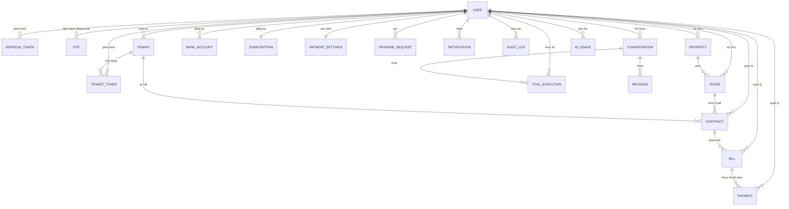

### 6.1.2. Mô tả

| Thực thể                                         | Vai trò                                                               | Nhóm       |
| -------------------------------------------------- | ---------------------------------------------------------------------- | ----------- |
| USER                                               | Chủ trọ (owner), nhân viên (staff), quản trị hệ thống (admin)  | Trung tâm  |
| PROPERTY                                           | Dãy trọ / toà nhà (đơn vị BĐS)                                 | Nghiệp vụ |
| ROOM                                               | Phòng cho thuê thuộc một PROPERTY                                  | Nghiệp vụ |
| TENANT                                             | Khách thuê                                                           | Nghiệp vụ |
| CONTRACT                                           | Hợp đồng thuê phòng (nối ROOM – TENANT)                         | Nghiệp vụ |
| BILL                                               | Hoá đơn tiền trọ theo tháng (điện, nước, phòng, phí khác) | Giao dịch  |
| PAYMENT                                            | Giao dịch thanh toán cho hoá đơn                                  | Giao dịch  |
| BANK_ACCOUNT                                       | Tài khoản ngân hàng nhận chuyển khoản (VietQR)                  | Giao dịch  |
| SUBSCRIPTION                                       | Gói đăng ký (free / basic / pro) của chủ trọ                    | Hệ thống  |
| UPGRADE_REQUEST                                    | Yêu cầu nâng cấp gói                                              | Hệ thống  |
| PAYMENT_SETTINGS                                   | Cấu hình cổng thanh toán MoMo / VNPay                              | Hệ thống  |
| NOTIFICATION                                       | Thông báo trong hệ thống                                           | Hệ thống  |
| AUDIT_LOG                                          | Nhật ký thao tác (audit trail)                                      | Hệ thống  |
| REFRESH_TOKEN                                      | Token làm mới phiên đăng nhập                                    | Xác thực  |
| OTP                                                | Mã xác thực một lần (theo email)                                  | Xác thực  |
| TENANT_TOKEN                                       | Token kích hoạt tài khoản khách thuê                             | Xác thực  |
| CONVERSATION / MESSAGE / TOOL_EXECUTION / AI_USAGE | Hội thoại, tin nhắn, thực thi tool và thống kê dùng AI Agent   | AI Agent    |

> **Ghi chú:**
>
> - `USER → USER` (nhân viên thuộc chủ trọ qua `ownerId`) là **tự tham chiếu** — không thể hiện trên sơ đồ `erDiagram`, xem cột `ownerId FK` của `USER`.
> - `OTP` **không mang khóa ngoại ObjectId** mà được **định danh theo `email`** (≈ `USER.email`), vì luồng **đăng ký** tạo OTP khi `USER` chưa tồn tại. Quan hệ logic này thể hiện là `USER o|--o{ OTP` (mỗi OTP ứng với 0..1 user).

---

## 6.2. Chuẩn hóa dữ liệu

> Mặc dù MongoDB là NoSQL và **chấp nhận phi chuẩn hóa** ở mức vật lý, ở mức **logic** nhóm vẫn phân rã dữ liệu
> theo nguyên tắc 1NF–2NF–3NF để tránh dư thừa và dị thường cập nhật, sau đó mới quyết định nhúng/tham chiếu cho phù hợp.

### 6.2.1. Dữ liệu ban đầu

Dữ liệu quản lý phòng trọ ban đầu thường được lưu dạng **phiếu thu / bảng Excel** phẳng, dồn mọi thông tin vào một dòng:

```
HOÁ ĐƠN(Mã hoá đơn,
        Tên chủ trọ, Email chủ trọ, SĐT chủ trọ,
        Tên dãy trọ, Địa chỉ dãy trọ,
        Tên phòng, Giá phòng, Diện tích,
        Tên khách, Email khách, SĐT khách, CMND khách, Địa chỉ khách, Ngày sinh,
        Ngày bắt đầu HĐ, Ngày kết thúc HĐ, Tiền cọc,
        Chỉ số điện cũ, Chỉ số điện mới, Đơn giá điện, Tiền điện,
        Chỉ số nước cũ, Chỉ số nước mới, Đơn giá nước, Tiền nước,
        Phí khác, Tổng tiền, Đã thanh toán, Trạng thái, Phương thức thanh toán)
```

### 6.2.2. Chuẩn hóa

#### 6.2.2.1. 1NF

- Mỗi thuộc tính phải mang **giá trị nguyên tử**: tách "họ tên" thành `fullName`, mỗi số điện thoại/email là một trường đơn.
- Không có **nhóm lặp**: mỗi hoá đơn chỉ chứa dữ liệu của **một tháng – một phòng – một hợp đồng**; các chỉ số điện/nước là từng trường riêng (`electricOldIndex`, `electricNewIndex`, …) thay vì một mảng lồng không tường minh.

_→ Dữ liệu đạt chuẩn 1NF._

#### 6.2.2.2. 2NF

Loại bỏ **phụ thuộc bộ phận** vào khóa chính. Trong dòng phẳng trên, thông tin **chủ trọ**, **dãy trọ**, **phòng**, **khách thuê** và **hợp đồng** không phụ thuộc vào `Mã hoá đơn` mà phụ thuộc vào khóa riêng của chúng. Do đó tách thành các thực thể riêng:

- `USER` — thông tin chủ trọ/nhân viên.
- `PROPERTY` — thông tin dãy trọ.
- `ROOM` — thông tin phòng.
- `TENANT` — thông tin khách thuê.
- `CONTRACT` — thông tin hợp đồng.
- `BILL` — chỉ còn giữ các thuộc tính **riêng của hoá đơn** (chỉ số điện/nước, tiền phòng, tổng tiền…) + khóa ngoại tới `CONTRACT`, `ROOM`, `TENANT`, `USER`.

_→ Dữ liệu đạt chuẩn 2NF._

#### 6.2.2.3. 3NF

Loại bỏ **phụ thuộc bắc cầu**:

- Trong `BILL`: `Mã hoá đơn → Mã hợp đồng → thông tin phòng/khách`. Thông tin phòng đã tách về `ROOM`, thông tin khách về `TENANT`; `BILL` chỉ giữ `contractId`, `roomId`, `tenantId`.
- Trong `ROOM`: `Mã phòng → Mã dãy trọ → thông tin dãy trọ`. Thông tin dãy trọ đã tách về `PROPERTY`; `ROOM` chỉ giữ `propertyId`.
- Trong `CONTRACT`: `Mã hợp đồng → Mã phòng / Mã khách → thông tin phòng/khách`. Đã tách về `ROOM`, `TENANT`.

_→ Dữ liệu đạt chuẩn 3NF._

### 6.2.3. Dữ liệu sau chuẩn hóa

```
USER        (_id, email, password, fullName, phone, role, ownerId [FK tự tham chiếu], isActive, ...)
PROPERTY    (_id, name, address, description, ownerId [FK])
ROOM        (_id, name, price, area, status, description, propertyId [FK], ownerId [FK])
TENANT      (_id, fullName, email, phone, identityCard, address, dob, ownerId [FK], ...)
CONTRACT    (_id, roomId [FK], tenantId [FK], startDate, endDate, deposit, rentPrice, status, ownerId [FK])
BILL        (_id, contractId [FK], roomId [FK], tenantId [FK], month, year, ...chỉ số điện/nước..., totalAmount, status, ownerId [FK])
PAYMENT     (_id, billId [FK], amount, method, status, transactionId, ownerId [FK])
BANK_ACCOUNT(_id, ownerId [FK], bankCode, bankName, bankBin, accountNumber, accountName, isDefault)
SUBSCRIPTION(_id, ownerId [FK unique], plan, status, roomLimit, propertyLimit, staffLimit, features)
...
```

### 6.2.4. Tách mối quan hệ N–N

- **ROOM – TENANT là quan hệ N–N**: một phòng qua nhiều thời kỳ có nhiều khách thuê; một khách có thể thuê nhiều phòng. Quan hệ này được phân rã bằng thực thể liên kết **CONTRACT** (`ROOM 1–N CONTRACT N–1 TENANT`), đồng thời mang thuộc tính riêng (`startDate`, `endDate`, `deposit`, `rentPrice`, `status`).
- **CONTRACT – BILL là quan hệ 1–N**: một hợp đồng phát sinh nhiều hoá đơn theo tháng (ràng buộc unique `contractId + month + year`).
- **BILL – PAYMENT là quan hệ 1–N**: một hoá đơn có thể được thanh toán nhiều lần (thanh toán một phần).

---

## 6.3. ERD Logical

### 6.3.1. Sơ đồ

Mô hình logic bổ sung **thuộc tính**, **khóa chính (PK)**, **khóa ngoại (FK)** và **khóa duy nhất (UK)** cho từng thực thể.
Do hệ thống có 20 thực thể, sơ đồ được tách thành **5 nhóm** — `USER` được lặp lại làm trung tâm mỗi nhóm.

#### Nhóm 1 — Xác thực & Tài khoản

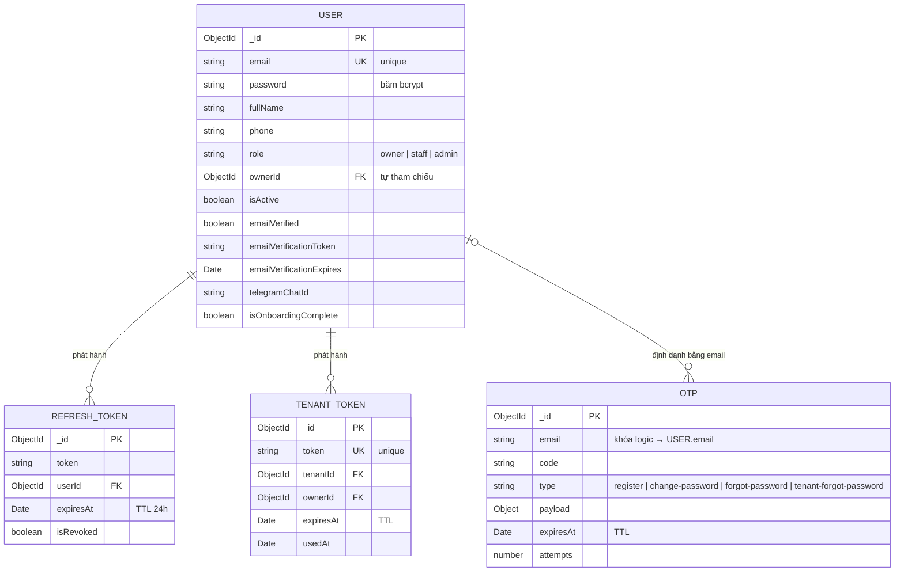

#### Nhóm 2 — BĐS – Khách thuê – Hợp đồng

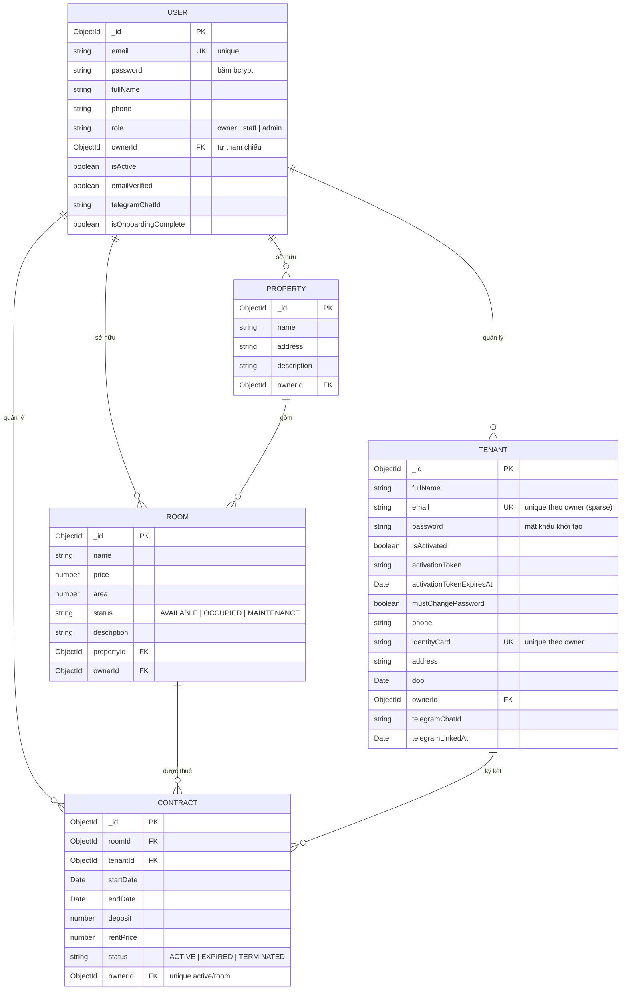

#### Nhóm 3 — Hóa đơn & Thanh toán

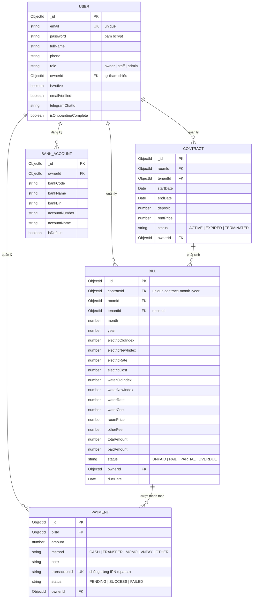

#### Nhóm 4 — Gói đăng ký – Cấu hình – Hệ thống

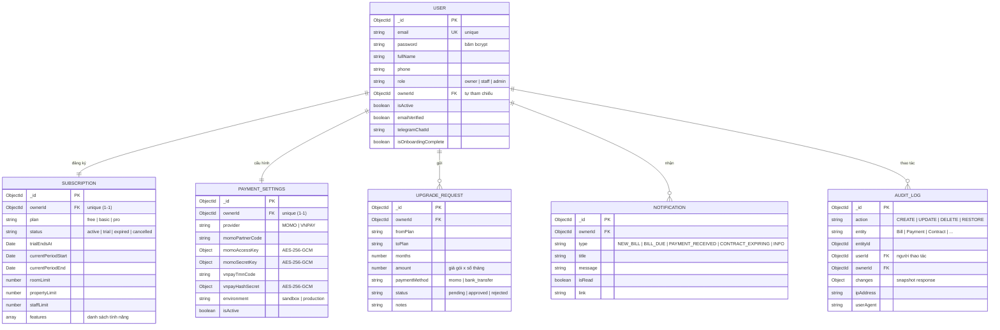

#### Nhóm 5 — AI Agent

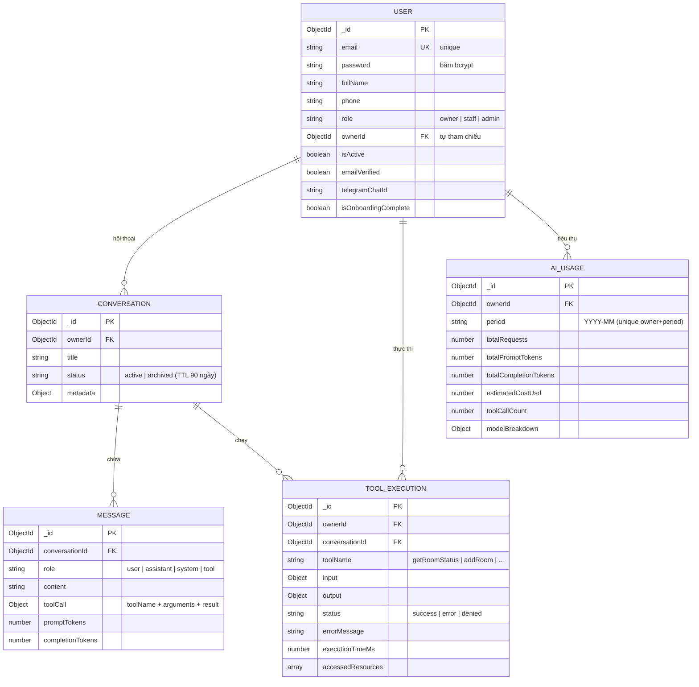

### 6.3.2. Mô tả

| TÊN THỰC THỂ                  | CHỨC NĂNG                                                                                                     |
| -------------------------------- | --------------------------------------------------------------------------------------------------------------- |
| **THỰC THỂ NGHIỆP VỤ** |                                                                                                                 |
| USER                             | Lưu tài khoản chủ trọ / nhân viên / admin (email, mật khẩu, vai trò, thuộc chủ trọ qua`ownerId`) |
| PROPERTY                         | Lưu dãy trọ / toà nhà (tên, địa chỉ)                                                                   |
| ROOM                             | Lưu phòng cho thuê (tên, giá, diện tích, trạng thái, thuộc dãy trọ)                                 |
| TENANT                           | Lưu hồ sơ khách thuê (họ tên, CMND, SĐT, email, trạng thái kích hoạt)                               |
| **THỰC THỂ GIAO DỊCH**  |                                                                                                                 |
| CONTRACT                         | Lưu hợp đồng thuê (nối phòng – khách, thời hạn, tiền cọc, giá thuê, trạng thái)                |
| BILL                             | Lưu hoá đơn tiền trọ theo tháng (chỉ số điện/nước, tiền phòng, tổng tiền, trạng thái)        |
| PAYMENT                          | Lưu giao dịch thanh toán cho hoá đơn (số tiền, phương thức, trạng thái, mã giao dịch)            |
| BANK_ACCOUNT                     | Lưu tài khoản ngân hàng nhận tiền (VietQR) của chủ trọ                                                |
| **THỰC THỂ HỆ THỐNG**  |                                                                                                                 |
| SUBSCRIPTION                     | Lưu gói đăng ký và giới hạn tài nguyên của chủ trọ                                                 |
| UPGRADE_REQUEST                  | Lưu yêu cầu nâng cấp gói đăng ký                                                                       |
| PAYMENT_SETTINGS                 | Lưu cấu hình cổng thanh toán MoMo / VNPay (mã hoá)                                                       |
| NOTIFICATION                     | Lưu thông báo nội bộ của chủ trọ                                                                        |
| AUDIT_LOG                        | Lưu nhật ký thao tác (action, entity, người thao tác, snapshot thay đổi)                               |
| **THỰC THỂ XÁC THỰC**  |                                                                                                                 |
| REFRESH_TOKEN                    | Lưu token làm mới phiên đăng nhập                                                                        |
| OTP                              | Lưu mã xác thực một lần theo email (đăng ký, quên mật khẩu…)                                       |
| TENANT_TOKEN                     | Lưu token kích hoạt tài khoản khách thuê                                                                 |
| **THỰC THỂ AI AGENT**    |                                                                                                                 |
| CONVERSATION                     | Lưu hội thoại với trợ lý AI                                                                               |
| MESSAGE                          | Lưu tin nhắn trong hội thoại (vai trò, nội dung, token)                                                   |
| TOOL_EXECUTION                   | Lưu lịch sử thực thi tool của AI Agent                                                                     |
| AI_USAGE                         | Lưu thống kê sử dụng AI theo tháng                                                                        |

**Mối quan hệ giữa các thực thể:**

- USER 1–N PROPERTY, ROOM, TENANT, CONTRACT, BILL, PAYMENT, BANK_ACCOUNT, NOTIFICATION, AUDIT_LOG, CONVERSATION, TOOL_EXECUTION, AI_USAGE.
- USER 1–1 SUBSCRIPTION, PAYMENT_SETTINGS (khóa ngoại `ownerId` là unique).
- PROPERTY 1–N ROOM.
- ROOM 1–N CONTRACT N–1 TENANT (phân rã quan hệ N–N).
- CONTRACT 1–N BILL (unique `contractId + month + year`).
- BILL 1–N PAYMENT.
- CONVERSATION 1–N MESSAGE, TOOL_EXECUTION.
- USER 1–N REFRESH_TOKEN, TENANT_TOKEN.
- USER 0..1 — 0..N OTP (định danh bằng `email`, không phải khóa ngoại).

---

## 6.4. ERD Physical

### 6.4.1. Sơ đồ

Mô hình vật lý thể hiện **kiểu dữ liệu BSON** cụ thể, **khóa chính `_id` (ObjectId)**,
**khóa ngoại (tham chiếu `ref`)** cùng các **ràng buộc vật lý** (unique, index, sparse, TTL, soft-delete).

#### Nhóm 1 — Xác thực & Tài khoản

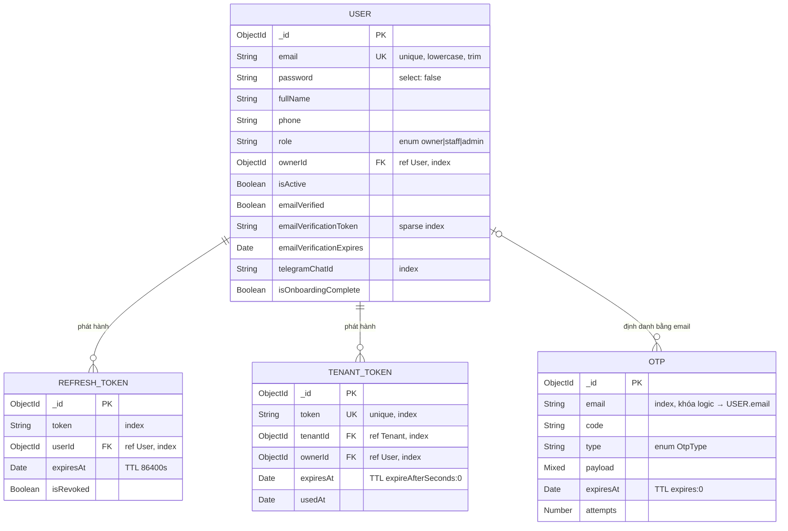

#### Nhóm 2 — BĐS – Khách thuê – Hợp đồng

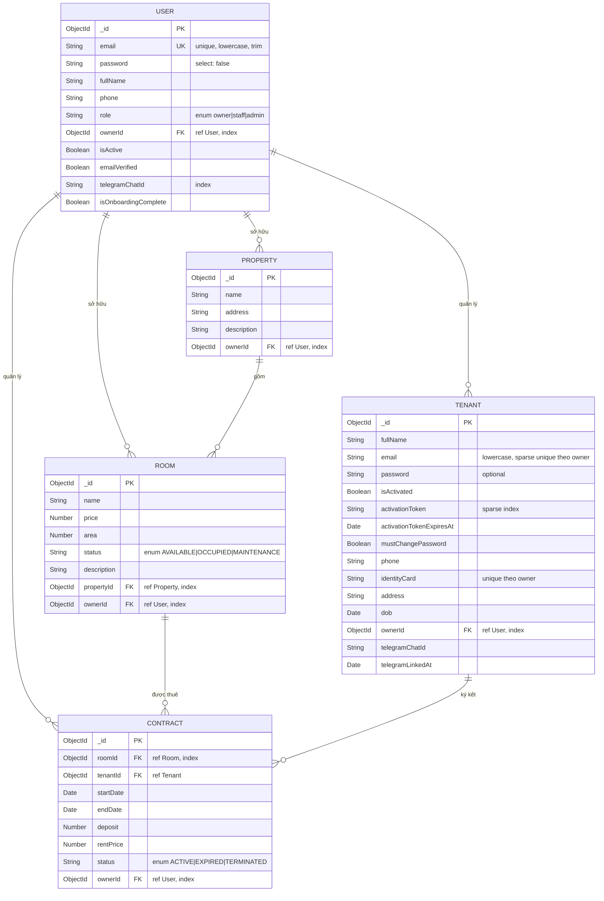

#### Nhóm 3 — Hóa đơn & Thanh toán

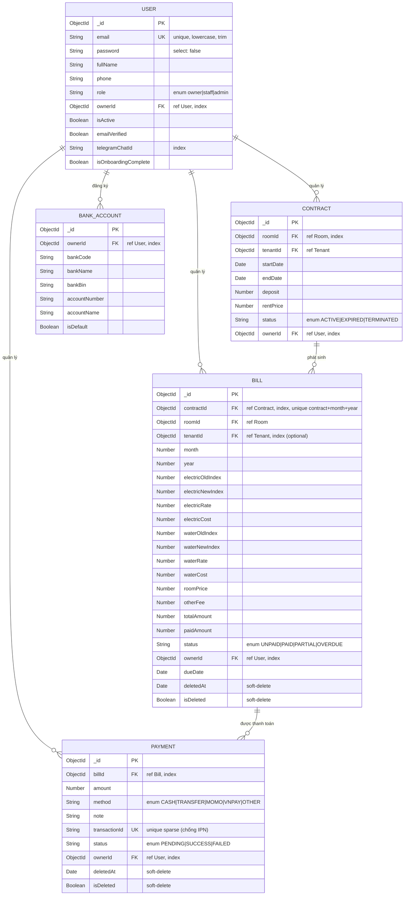

#### Nhóm 4 — Gói đăng ký – Cấu hình – Hệ thống

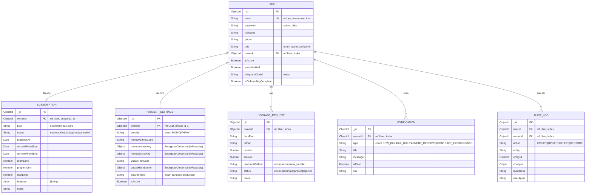

#### Nhóm 5 — AI Agent

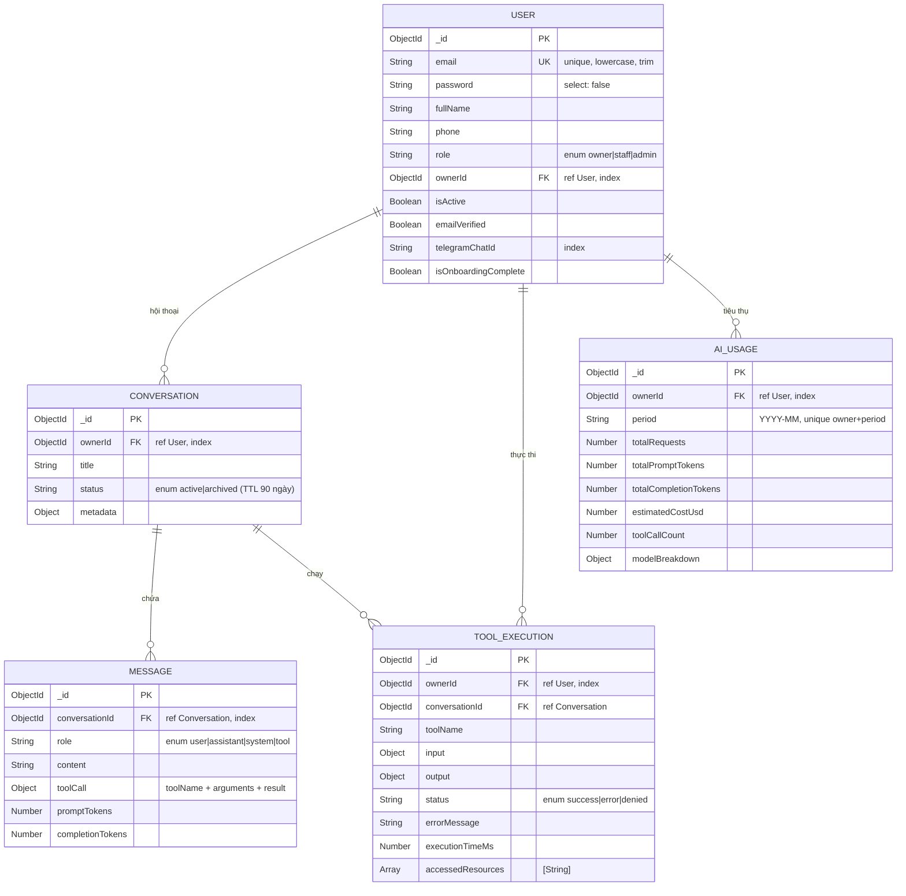

### 6.4.2. Schema MongoDB (tương đương DDL)

Vì hệ thống dùng MongoDB, **không có câu lệnh `CREATE TABLE`**; thay vào đó là **collection + index** được
định nghĩa qua Mongoose. Bảng dưới đây ánh xạ thực thể → collection và liệt kê các ràng buộc vật lý quan trọng.

#### Ánh xạ thực thể → Collection

| Thực thể    | Collection                 | Thực thể       | Collection          |
| ------------- | -------------------------- | ---------------- | ------------------- |
| USER          | `users`                  | BANK_ACCOUNT     | `bankaccounts`    |
| REFRESH_TOKEN | `auth` (refresh tokens)  | SUBSCRIPTION     | `subscriptions`   |
| OTP           | `otps`                   | UPGRADE_REQUEST  | `upgraderequests` |
| TENANT_TOKEN  | `tenanttokens`           | PAYMENT_SETTINGS | `paymentsettings` |
| PROPERTY      | `properties`             | NOTIFICATION     | `notifications`   |
| ROOM          | `rooms`                  | AUDIT_LOG        | `auditlogs`       |
| TENANT        | `tenants`                | CONVERSATION     | `conversations`   |
| CONTRACT      | `contracts`              | MESSAGE          | `messages`        |
| BILL          | `bills` (soft-delete)    | TOOL_EXECUTION   | `toolexecutions`  |
| PAYMENT       | `payments` (soft-delete) | AI_USAGE         | `aiusages`        |

#### Ràng buộc unique / partial unique

| Collection          | Ràng buộc                                | Ý nghĩa                                                                                      |
| ------------------- | ------------------------------------------ | ---------------------------------------------------------------------------------------------- |
| `users`           | `email` unique                           | Một email = một tài khoản                                                                  |
| `tenants`         | `{ownerId, identityCard}` unique         | CMND duy nhất trong phạm vi một chủ trọ                                                   |
| `tenants`         | `{ownerId, email}` unique (sparse)       | Email khách thuê duy nhất theo chủ trọ (bỏ qua null/rỗng)                               |
| `contracts`       | `{roomId}` partial (`status = ACTIVE`) | Mỗi phòng chỉ có**một** hợp đồng active (chống đặt trùng khi race-condition) |
| `bills`           | `{contractId, month, year}` unique       | Mỗi hợp đồng chỉ có một hoá đơn/tháng                                               |
| `payments`        | `transactionId` unique (sparse)          | Chống ghi trùng giao dịch khi MoMo/VNPay gọi IPN nhiều lần                               |
| `subscriptions`   | `ownerId` unique                         | Một chủ trọ một gói đăng ký                                                            |
| `paymentsettings` | `ownerId` unique                         | Một chủ trọ một bộ cấu hình thanh toán                                                 |
| `aiusages`        | `{ownerId, period}` unique               | Một chủ trọ một bản thống kê/tháng                                                     |

#### Index phục vụ truy vấn

| Collection          | Index                                                                | Mục đích                                                             |
| ------------------- | -------------------------------------------------------------------- | ----------------------------------------------------------------------- |
| `users`           | `ownerId`, `telegramChatId`, `emailVerificationToken` (sparse) | Lọc nhân viên theo chủ trọ, đối chiếu Telegram, xác minh email |
| `properties`      | `{ownerId, name}`                                                  | Liệt kê dãy trọ theo chủ trọ                                      |
| `rooms`           | `{propertyId, status}`, `ownerId`                                | Tra cứu phòng theo dãy trọ + trạng thái                           |
| `tenants`         | `ownerId`, `activationToken` (sparse)                            | Lọc khách thuê, tra token kích hoạt                                |
| `contracts`       | `{roomId, status}`, `{ownerId, status}`                          | Tra hợp đồng active của phòng / của chủ trọ                     |
| `bills`           | `{ownerId, status}`, `contractId`, `tenantId`                  | Dashboard nợ, lọc theo chủ trọ, hợp đồng, khách                 |
| `payments`        | `billId`, `ownerId`                                              | Liệt kê thanh toán theo hoá đơn / chủ trọ                       |
| `bankaccounts`    | `{ownerId, isDefault}`                                             | Lấy tài khoản mặc định nhận tiền                                |
| `notifications`   | `{ownerId, createdAt}`, `{ownerId, isRead}`                      | Thông báo mới / chưa đọc                                          |
| `auditlogs`       | `{ownerId, createdAt}`, `{entity, entityId}`                     | Timeline nhật ký, tra theo đối tượng                              |
| `conversations`   | `{ownerId, updatedAt}`                                             | Danh sách hội thoại gần đây                                       |
| `messages`        | `{conversationId, createdAt}`                                      | Lịch sử tin nhắn                                                     |
| `toolexecutions`  | `{ownerId, createdAt}`, `{toolName, status}`                     | Lịch sử tool                                                          |
| `upgraderequests` | `ownerId`                                                          | Lọc yêu cầu nâng cấp                                               |

#### TTL index (tự động xoá)

| Collection              | TTL                                                       | Ý nghĩa                                        |
| ----------------------- | --------------------------------------------------------- | ------------------------------------------------ |
| `auth` (RefreshToken) | `expiresAt` → 86400s                                   | Xoá refresh token sau 24h                       |
| `otps`                | `expiresAt` → `expires: 0`                           | Xoá OTP ngay khi hết hạn                      |
| `tenanttokens`        | `expiresAt` → `expireAfterSeconds: 0`                | Xoá token kích hoạt khi hết hạn             |
| `conversations`       | `updatedAt` → 90 ngày (partial `status = archived`) | Tự xoá hội thoại đã lưu trữ sau 90 ngày |

#### Ghi chú vật lý khác

- **Soft-delete**: `BILL` và `PAYMENT` dùng plugin `softDeletePlugin` (thêm `isDeleted`, `deletedAt`) để hỗ trợ khôi phục, thay vì xoá cứng.
- **Mã hoá**: `PAYMENT_SETTINGS` mã hoá thông tin nhạy cảm MoMo/VNPay bằng **AES-256-GCM** (lưu dạng `{iv, data, tag}`).
- **Timestamps**: mọi collection đều bật `timestamps: true` → tự sinh `createdAt`, `updatedAt` (và `auditlogs` dùng `createdAt` làm trục timeline).
- **Đa chủ sở hữu (multi-tenant)**: hầu hết collection đều mang `ownerId` để cô lập dữ liệu giữa các chủ trọ; các truy vấn luôn kèm `ownerId`.
