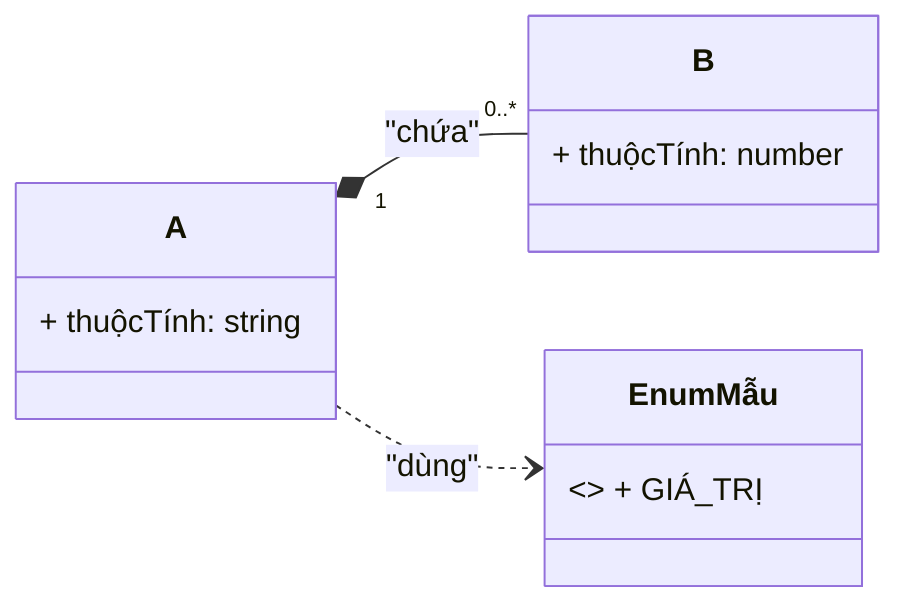
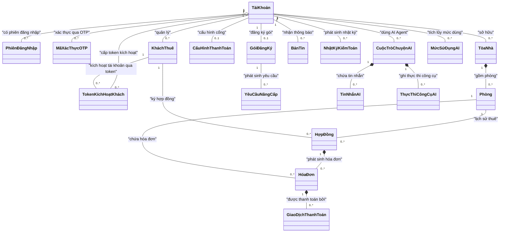
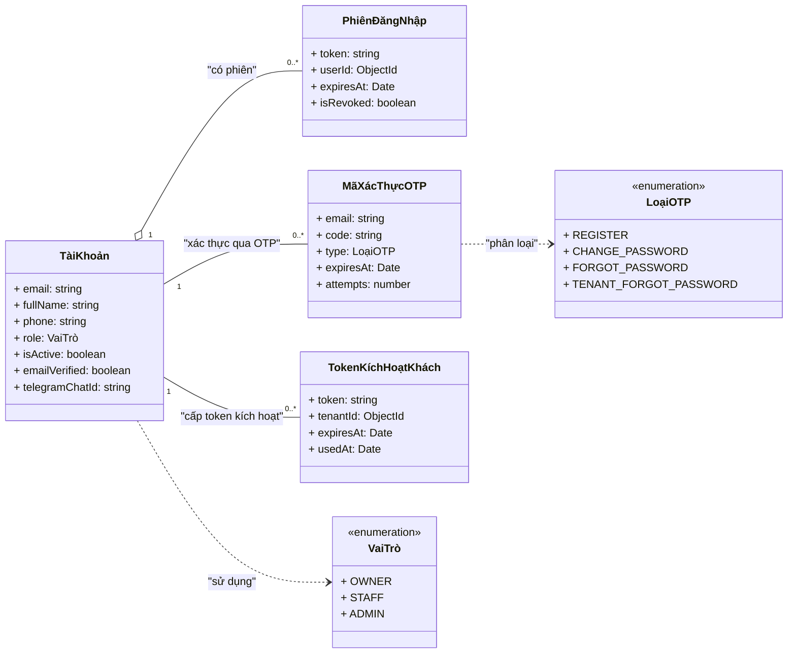
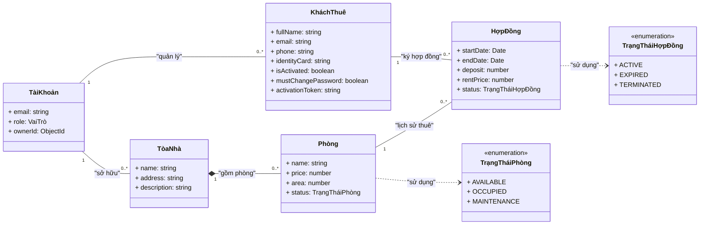
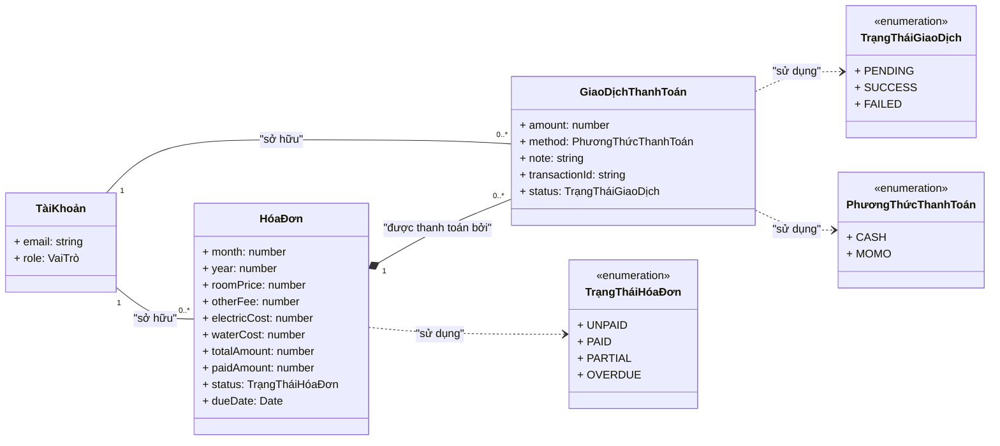
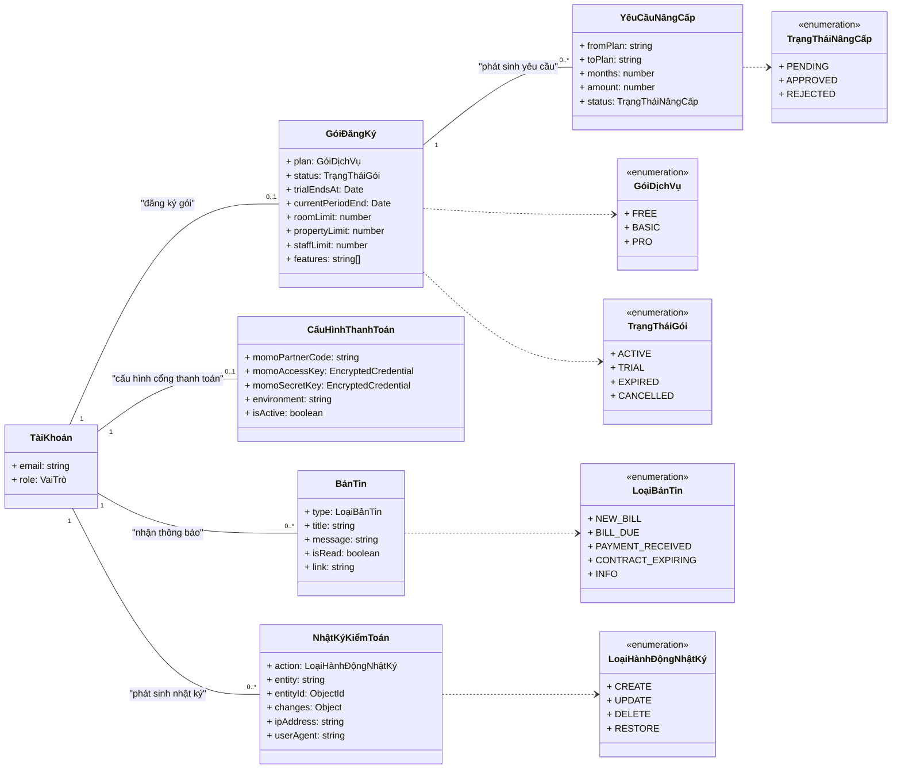
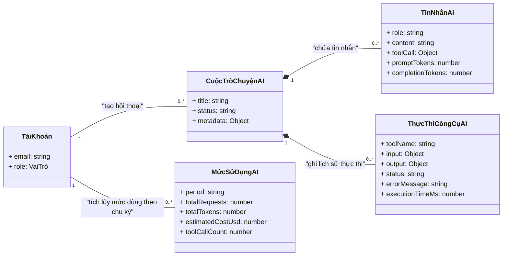

# 🧬 Class Diagram (UML) — Hệ thống Quản lý Cho thuê SaaS

> Class Diagram mô tả **mô hình lớp miền (domain entities)** của `rental-saas-backend` (NestJS + Mongoose) — là **Class Diagram tổng thể** do **TV7 (Mạnh)** ghép từ cụm lớp đề xuất của TV1–TV6.
> Mô hình gồm **19 lớp entity**. Nhóm chốt **chỉ dùng MOMO (+ CASH)** cho thanh toán nên các phần của VNPay/VietQR (`TàiKhoảnNgânHàng`, provider `VNPAY`, `TRANSFER`) được **lược khỏi mô hình** — `ERD.md` hiện vẫn liệt kê 20 thực thể (xem mục 10, điểm rà soát f). Tên lớp dùng **tiếng Việt**, kèm annotation **entity tiếng Anh + collection** để truy vết code.
> Dùng **Mermaid thuần** (`classDiagram`) — render được ở Mermaid Live, VS Code, GitHub, draw.io.

**Phạm vi (đã chốt):** chỉ mô hình hóa **lớp thực thể miền + enum nghiệp vụ**. Controller / Service / Repository / giao diện là lớp phân tích–thiết kế **không nằm trong sơ đồ**; chúng được dùng ở mục 8 để đối chiếu đối tượng trong Sequence Diagram với lớp entity mà chúng thao tác.

---

## 1. Ký hiệu (Notation)

| Ký hiệu   | Ý nghĩa trong Class Diagram                                         | Tương đương Crow's Foot (ERD.md)             |
| ----------- | --------------------------------------------------------------------- | ------------------------------------------------- |
| `A -- B`  | Association (liên kết)                                              | `A --- B`                                       |
| `A o-- B` | Aggregation (hợp thành – "có", bộ phận tồn tại độc lập)    | `o` ở phía bộ phận                          |
| `A *-- B` | Composition (kết hợp – bộ phận gắn vòng đời với tổng thể) | bộ phận không tồn tại nếu thiếu tổng thể |
| `A <        | -- B`                                                                 | Inheritance / generalization (kế thừa)          |
| `A ..> B` | Dependency (phụ thuộc, VD lớp dùng enum)                          | —                                                |
| `"1"`     | Đúng một                                                           | `\|\|`                                            |
| `"0..1"`  | Không hoặc một                                                     | `o`                                             |
| `"0..*"`  | Không hoặc nhiều                                                   | `o{`                                            |
| `"1..*"`  | Một hoặc nhiều                                                     | `}{`                                            |

> **Ghi chú đọc sơ đồ:** nhiều quan hệ trong code được lưu dưới dạng cột `ObjectId` (`ref`) — trong Class Diagram chúng được vẽ **thành đường quan hệ + bản số**, không hiện lại dưới dạng thuộc tính. Riêng `ownerId` (denormalized trên gần như mọi lớp để cô lập dữ liệu theo tài khoản chủ) **không vẽ thành cạnh cho từng lớp con** để tránh rối — xem mục 3.

Minh họa nhanh (không phải sơ đồ chính thức):

---

## 2. Quy ước đặt tên & ánh xạ lớp ↔ collection

**Quy tắc:**

- Tên lớp tiếng Việt không dấu cách (VD `HợpĐồng`, `GiaoDịchThanhToán`); annotation `(Entity EN)` + `collection`.
- Thuộc tính giữ tên field tiếng Anh trong code (khớp Data Dictionary / ERD / Schema), kiểu theo TypeScript/Mongoose: `string`, `number`, `Date`, `boolean`, `enum`, `ObjectId`, `Object`.
- Các cột `ObjectId` kiểu ref (VD `contractId`, `roomId`) được thể hiện thành **quan hệ** — không nằm trong danh sách thuộc tính.
- Enum nghiệp vụ là **lớp `<<enumeration>>`** (không phải collection); lớp có thuộc tính enum sẽ vẽ dependency tới lớp enumeration đó.

### 2.1. Danh sách 19 lớp entity (bảng master)

| STT | Lớp (tiếng Việt)   | Entity (EN)     | Collection          | Nguồn module / Use Case                           | Nhóm      |
| --- | --------------------- | --------------- | ------------------- | -------------------------------------------------- | ---------- |
| 1   | TàiKhoản            | User            | `users`           | auth, users, admin, tenant-auth (P1, P5, P6)       | trung tâm |
| 2   | PhiênĐăngNhập     | RefreshToken    | `refreshtokens`   | auth (P1)                                          | 2.1        |
| 3   | MãXácThựcOTP       | Otp             | `otps`            | auth, tenant-auth (P1)                             | 2.1        |
| 4   | TokenKíchHoạtKhách | TenantToken     | `tenanttokens`    | tenant-auth (P1) — magic-link**deprecated** | 2.1        |
| 5   | TòaNhà              | Property        | `properties`      | properties (P2)                                    | 2.2        |
| 6   | Phòng                | Room            | `rooms`           | rooms (P2)                                         | 2.2        |
| 7   | KháchThuê           | Tenant          | `tenants`         | tenants (P3, P6)                                   | 2.2        |
| 8   | HợpĐồng            | Contract        | `contracts`       | contracts (P3)                                     | 2.2        |
| 9   | HóaĐơn             | Bill            | `bills`           | bills, invoice, cron (P4, P6, P8, P9)              | 2.3        |
| 10  | GiaoDịchThanhToán   | Payment         | `payments`        | payments, momo (P4)                                | 2.3        |
| 11  | GóiĐăngKý         | Subscription    | `subscriptions`   | subscription (P5)                                  | 2.4        |
| 12  | YêuCầuNângCấp     | UpgradeRequest  | `upgraderequests` | subscription (P5)                                  | 2.4        |
| 13  | CấuHìnhThanhToán   | PaymentSettings | `paymentsettings` | payment-settings (P4, P5)                          | 2.4        |
| 14  | BảnTin*              | Notification    | `notifications`   | notifications (P9)                                 | 2.4        |
| 15  | NhậtKýKiểmToán    | AuditLog        | `auditlogs`       | audit (P5)                                         | 2.4        |
| 16  | CuộcTròChuyệnAI    | Conversation    | `conversations`   | ai-agent (P7)                                      | 2.5        |
| 17  | TinNhắnAI            | Message         | `messages`        | ai-agent (P7)                                      | 2.5        |
| 18  | ThựcThiCôngCụAI    | ToolExecution   | `toolexecutions`  | ai-agent (P7)                                      | 2.5        |
| 19  | MứcSửDụngAI        | AiUsage         | `aiusages`        | ai-agent (P7)                                      | 2.5        |

> Collection ở cột trên là **tên thật do Mongoose tự đặt** (pluralize model name) vì code không khai báo `collection:` thủ công. Lưu ý: ERD.md mục 3 ghi `REFRESH_TOKEN → auth`; theo code hiện tại là `refreshtokens` (xem mục 10, điểm rà soát d).

### 2.2. Các lớp `<<enumeration>>`

| Lớp enumeration            | Entity enum (code)   | Giá trị (literal code)                                           | Ghi chú nghiệp vụ                                                                                                            |
| --------------------------- | -------------------- | ------------------------------------------------------------------ | ------------------------------------------------------------------------------------------------------------------------------- |
| VaiTrò                     | Role                 | OWNER, STAFF, ADMIN                                                | OWNER=Chủ nhà (tự đăng ký, sở hữu dữ liệu); STAFF=Nhân viên (do OWNER tạo); ADMIN=Quản trị viên nền tảng SaaS |
| TrạngTháiPhòng           | RoomStatus           | AVAILABLE, OCCUPIED, MAINTENANCE                                   | Phòng thuộc`Phòng`                                                                                                         |
| TrạngTháiHợpĐồng       | ContractStatus       | ACTIVE, EXPIRED, TERMINATED                                        | Tối đa 1 ACTIVE/phòng                                                                                                        |
| TrạngTháiHóaĐơn        | BillStatus           | UNPAID, PAID, PARTIAL, OVERDUE                                     | Cập nhật qua`paidAmount`                                                                                                    |
| TrạngTháiGiaoDịch        | PaymentStatus        | PENDING, SUCCESS, FAILED                                           | GiaoDịchThanhToán                                                                                                             |
| PhươngThứcThanhToán     | PaymentMethod        | CASH, MOMO                                                         | payments.method — CASH tại chỗ / MOMO qua cổng                                                                              |
| GóiDịchVụ                | SubscriptionPlan     | FREE, BASIC, PRO                                                   | GóiĐăngKý.plan                                                                                                              |
| TrạngTháiGói             | SubscriptionStatus   | ACTIVE, TRIAL, EXPIRED, CANCELLED                                  | Cron hạ cấp khi hết hạn                                                                                                     |
| TrạngTháiNângCấp        | UpgradeRequestStatus | PENDING, APPROVED, REJECTED                                        | YêuCầuNângCấp                                                                                                               |
| LoạiOTP                    | OtpType              | REGISTER, CHANGE_PASSWORD, FORGOT_PASSWORD, TENANT_FORGOT_PASSWORD | TTL 5 phút                                                                                                                     |
| LoạiBảnTin*               | NotificationType     | NEW_BILL, BILL_DUE, PAYMENT_RECEIVED, CONTRACT_EXPIRING, INFO      | BảnTin                                                                                                                         |
| LoạiHànhĐộngNhậtKý    | (action string)      | CREATE, UPDATE, DELETE, RESTORE                                    | NhậtKýKiểmToán.action                                                                                                       |
| VaiTròTinNhắn             | (role string)        | user, assistant, system, tool                                      | TinNhắnAI                                                                                                                      |
| TrạngTháiThựcThiCôngCụ | (status string)      | success, error, denied                                             | ThựcThiCôngCụAI                                                                                                              |

> **(\*) Lưu ý đặt tên:** hai tên tiếng Việt gốc `ThôngBáo` / `LoạiThôngBáo` **không dùng làm tên lớp** vì Mermaid `classDiagram` báo parse error với tên lớp kết thúc bằng *nguyên âm có dấu + `o`* (`…Báo` — lexer tách chữ `o` cuối thành token `AGGREGATION`). Đã đổi thành **`BảnTin` (Notification)** / **`LoạiBảnTin` (NotificationType)**, giữ nguyên collection `notifications`, giá trị enum và bản chất quan hệ. Xem mục 10 (g).

---

## 3. Class Diagram tổng thể

Sơ đồ chính (01 Class Diagram tổng thể của TV7): **19 lớp entity**, chỉ tên lớp + quan hệ + bản số. Các cạnh nghiệp vụ được vẽ; **không** vẽ lại `ownerId` denormalized của từng lớp con (ghi chú thay thế).

> **Cách đọc:** `TàiKhoản -- GóiĐăngKý` thể hiện **1 OWNER có tối đa 1 gói** (Subscription `ownerId` unique). Cạnh `HợpĐồng *-- HóaĐơn` / `HóaĐơn *-- GiaoDịchThanhToán` là **composition** (vòng đời bộ phận gắn với tổng thể). Các quan hệ sở hữu `ownerId` của HợpĐồng/HóaĐơn/GiaoDịch/Phòng… không vẽ riêng vì chúng đã gián tiếp thuộc về `TàiKhoản` qua chuỗi composition ở trên (và đều denormalized trong code). Riêng `MãXácThựcOTP`/`TokenKíchHoạtKhách` là lớp xác thực thoáng qua **không nằm trong chuỗi composition** nên được nối thẳng với `TàiKhoản`/`KháchThuê` để không bị "treo".

---

## 4. Class Diagram theo nhóm

Các sơ đồ nhóm có **thuộc tính tiêu biểu** (đầy đủ ở mục 5) và enum cục bộ để dễ đọc và tiện đối chiếu từng nhóm Sequence Diagram. Lớp `TàiKhoản` được lặp lại làm trung tâm như trong `ERD.md`.

### 4.1 Xác thực & Tài khoản (khớp cụm TV1)

### 4.2 BĐS — Khách thuê — Hợp đồng (khớp cụm TV4 + TV5)

### 4.3 Hóa đơn & Thanh toán (khớp cụm TV2)

> **Cách đọc:** cạnh `TàiKhoản -- HóaĐơn` / `TàiKhoản -- GiaoDịchThanhToán` thể hiện **hóa đơn & giao dịch thanh toán thuộc chủ nhà** (Bill/Payment đều mang `ownerId` → User, denormalized), vẽ ở **cấp nhóm** để khớp ERD 2.3 (`USER \|\|--o\{ BILL/PAYMENT : "sở hữu"`). Ở sơ đồ tổng thể §3 các cạnh `ownerId` lá này **không vẽ riêng** (đã gián tiếp thuộc về `TàiKhoản` qua chuỗi composition) — hai cấp vẽ bổ sung cho nhau, không mâu thuẫn.

### 4.4 Gói đăng ký — Cấu hình — Hệ thống (nhóm 2.4 của ERD)

### 4.5 AI Agent (khớp cụm TV6 — hỗ trợ bằng AI)

---

## 5. Bảng thuộc tính chi tiết

> Mọi lớp đều có `createdAt`/`updatedAt` (timestamps) — không liệt kê lại. Cột `ObjectId` dạng `ref` đã thể hiện thành quan hệ ở mục 3–4; ở đây chỉ ghi các trường hợp cần làm rõ ràng buộc.

### 5.1. Tài khoản & Xác thực

#### TàiKhoản (User) — `users`

| Thuộc tính             | Kiểu           | Ràng buộc / Ghi chú                                                                     |
| ------------------------ | --------------- | ------------------------------------------------------------------------------------------ |
| email                    | string          | required,**unique**, lowercase, trim                                                 |
| password                 | string          | required (bcrypt hash),`select:false`                                                    |
| fullName                 | string          | required, trim                                                                             |
| phone                    | string          | trim                                                                                       |
| role                     | `VaiTrò`     | required, default STAFF                                                                    |
| ownerId                  | ObjectId (User) | required;**tự tham chiếu** — OWNER trỏ chính mình; STAFF/ADMIN trỏ OWNER chủ |
| isActive                 | boolean         | default true (ADMIN khóa/mở)                                                             |
| telegramChatId           | string          | index — liên kết Telegram của OWNER                                                    |
| emailVerified            | boolean         | default false                                                                              |
| emailVerificationToken   | string          | sparse index — link xác thực email                                                      |
| emailVerificationExpires | Date            | —                                                                                         |
| isOnboardingComplete     | boolean         | default false                                                                              |

#### PhiênĐăngNhập (RefreshToken) — `refreshtokens`

| Thuộc tính | Kiểu           | Ràng buộc / Ghi chú                          |
| ------------ | --------------- | ----------------------------------------------- |
| token        | string          | required, index — chuỗi ngẫu nhiên 64 hex   |
| userId       | ObjectId (User) | required, index                                 |
| expiresAt    | Date            | required,**TTL 1 ngày**                  |
| isRevoked    | boolean         | default false — revoke khi logout / xoay token |

#### MãXácThựcOTP (Otp) — `otps`

| Thuộc tính | Kiểu        | Ràng buộc / Ghi chú                         |
| ------------ | ------------ | ---------------------------------------------- |
| email        | string       | required, index                                |
| code         | string       | required                                       |
| type         | `LoạiOTP` | required                                       |
| payload      | Mixed        | dữ liệu kèm (VD password hash khi register) |
| expiresAt    | Date         | required, TTL (5 phút)                        |
| attempts     | number       | default 0 — tối đa 5 lần                   |

#### TokenKíchHoạtKhách (TenantToken) — `tenanttokens`

| Thuộc tính | Kiểu             | Ràng buộc / Ghi chú           |
| ------------ | ----------------- | -------------------------------- |
| token        | string            | required,**unique**, index |
| tenantId     | ObjectId (Tenant) | required, index                  |
| ownerId      | ObjectId (User)   | required, index                  |
| expiresAt    | Date              | required, TTL                    |
| usedAt       | Date              | default null — dùng 1 lần     |

### 5.2. BĐS — Khách thuê — Hợp đồng

#### TòaNhà (Property) — `properties`

| Thuộc tính | Kiểu           | Ràng buộc / Ghi chú                                       |
| ------------ | --------------- | ------------------------------------------------------------ |
| name         | string          | required, trim                                               |
| address      | string          | required, trim                                               |
| description  | string          | trim                                                         |
| ownerId      | ObjectId (User) | required, index — bị chặn bởi`propertyLimit` của gói |

#### Phòng (Room) — `rooms`

| Thuộc tính | Kiểu                 | Ràng buộc / Ghi chú                              |
| ------------ | --------------------- | --------------------------------------------------- |
| name         | string                | required                                            |
| price        | number                | required                                            |
| area         | number                | —                                                  |
| status       | `TrạngTháiPhòng` | default AVAILABLE; do luồng hợp đồng cập nhật |
| description  | string                | trim                                                |
| propertyId   | ObjectId (Property)   | required, index                                     |
| ownerId      | ObjectId (User)       | required, index — bị chặn bởi`roomLimit`      |

#### KháchThuê (Tenant) — `tenants`

| Thuộc tính                      | Kiểu           | Ràng buộc / Ghi chú                                   |
| --------------------------------- | --------------- | -------------------------------------------------------- |
| fullName                          | string          | required                                                 |
| email                             | string          | tùy chọn;**unique+sparse theo (ownerId, email)** |
| password                          | string          | — dành cho cổng khách thuê                          |
| isActivated                       | boolean         | default false                                            |
| activationToken                   | string          | sparse index — token đặt mật khẩu lần đầu        |
| activationTokenExpiresAt          | Date            | —                                                       |
| mustChangePassword                | boolean         | default false — đổi MK lần đầu bắt buộc          |
| phone                             | string          | required                                                 |
| identityCard                      | string          | required;**unique (ownerId, identityCard)**        |
| address / dob                     | string / Date   | —                                                       |
| ownerId                           | ObjectId (User) | required, index                                          |
| telegramChatId / telegramLinkedAt | string / Date   | nhận hóa đơn & link MoMo qua bot                     |

#### HợpĐồng (Contract) — `contracts`

| Thuộc tính        | Kiểu                     | Ràng buộc / Ghi chú                                                     |
| ------------------- | ------------------------- | -------------------------------------------------------------------------- |
| roomId              | ObjectId (Room)           | required, index;**partial-unique khi ACTIVE** (1 hợp đồng/phòng) |
| tenantId            | ObjectId (Tenant)         | required                                                                   |
| startDate / endDate | Date                      | required                                                                   |
| deposit             | number                    | default 0 —**tiền cọc** (không phải lớp riêng)                |
| rentPrice           | number                    | required                                                                   |
| status              | `TrạngTháiHợpĐồng` | default ACTIVE                                                             |
| ownerId             | ObjectId (User)           | required, index                                                            |

### 5.3. Hóa đơn & Thanh toán

#### HóaĐơn (Bill) — `bills` *(soft-delete)*

| Thuộc tính                                                      | Kiểu                     | Ràng buộc / Ghi chú                                     |
| ----------------------------------------------------------------- | ------------------------- | ---------------------------------------------------------- |
| contractId                                                        | ObjectId (Contract)       | required, index;**unique (contractId, month, year)** |
| roomId                                                            | ObjectId (Room)           | required (denormalized cho PDF)                            |
| tenantId                                                          | ObjectId (Tenant)         | optional (denormalized)                                    |
| month / year                                                      | number                    | required (month 1–12)                                     |
| electricOldIndex / electricNewIndex / electricRate / electricCost | number                    | required —**Chỉ số điện** (new ≥ old)          |
| waterOldIndex / waterNewIndex / waterRate / waterCost             | number                    | required —**Chỉ số nước**                       |
| roomPrice                                                         | number                    | required (snapshot giá phòng lúc lập hóa đơn)       |
| otherFee                                                          | number                    | default 0                                                  |
| totalAmount                                                       | number                    | required = roomPrice + điện + nước + otherFee          |
| paidAmount                                                        | number                    | default 0                                                  |
| status                                                            | `TrạngTháiHóaĐơn`  | default UNPAID                                             |
| dueDate                                                           | Date                      | —                                                         |
| ownerId                                                           | ObjectId (User)           | required, index                                            |
| isDeleted / deletedAt / deletedBy                                 | boolean / Date / ObjectId | soft-delete                                                |

> `ChiTiếtHóaĐơn` (TV2) và `ChỉSốĐiệnNước` (TV4) được **gộp thành các trường chi phí/chỉ số trên HóaĐơn** — xem mục 7.

#### GiaoDịchThanhToán (Payment) — `payments` *(soft-delete)*

| Thuộc tính                      | Kiểu                       | Ràng buộc / Ghi chú                                     |
| --------------------------------- | --------------------------- | ---------------------------------------------------------- |
| billId                            | ObjectId (Bill)             | required, index                                            |
| amount                            | number                      | required, min 0 — chặn thanh toán vượt nợ            |
| method                            | `PhươngThứcThanhToán` | default CASH                                               |
| note                              | string                      | trim                                                       |
| ownerId                           | ObjectId (User)             | required, index                                            |
| transactionId                     | string                      | **unique+sparse** — MoMo transId, chống IPN trùng |
| status                            | `TrạngTháiGiaoDịch`    | default SUCCESS                                            |
| isDeleted / deletedAt / deletedBy | boolean / Date / ObjectId   | soft-delete                                                |

### 5.4. Gói đăng ký — Cấu hình — Hệ thống

#### GóiĐăngKý (Subscription) — `subscriptions`

| Thuộc tính                           | Kiểu               | Ràng buộc / Ghi chú                                 |
| -------------------------------------- | ------------------- | ------------------------------------------------------ |
| ownerId                                | ObjectId (User)     | required,**unique** (1:1 với OWNER)             |
| plan                                   | `GóiDịchVụ`    | required, default FREE                                 |
| status                                 | `TrạngTháiGói` | required, default ACTIVE                               |
| trialEndsAt                            | Date                | đăng ký mới → FREE/TRIAL 14 ngày                 |
| currentPeriodStart / currentPeriodEnd  | Date                | —                                                     |
| roomLimit / propertyLimit / staffLimit | number              | theo plan (hằng`PLAN_LIMITS`)                       |
| features                               | string[]            | default [] —`reports`, `telegram`, `ai-agent`… |
| notes                                  | string              | trim                                                   |

#### YêuCầuNângCấp (UpgradeRequest) — `upgraderequests`

| Thuộc tính      | Kiểu                    | Ràng buộc / Ghi chú                         |
| ----------------- | ------------------------ | ---------------------------------------------- |
| ownerId           | ObjectId (User)          | required, index                                |
| fromPlan / toPlan | string                   | required                                       |
| months            | number                   | required, min 1                                |
| amount            | number                   | required — giá theo`PLAN_PRICES`           |
| paymentMethod     | enum nội bộ            | `'momo'` — thanh toán phí nâng cấp gói |
| status            | `TrạngTháiNângCấp` | default PENDING                                |
| notes             | string                   | trim                                           |

#### CấuHìnhThanhToán (PaymentSettings) — `paymentsettings`

| Thuộc tính                  | Kiểu                   | Ràng buộc / Ghi chú         |
| ----------------------------- | ----------------------- | ------------------------------ |
| ownerId                       | ObjectId (User)         | required,**unique**      |
| momoPartnerCode               | string                  | —                             |
| momoAccessKey / momoSecretKey | Object`{iv,data,tag}` | **AES-256-GCM** mã hóa |
| environment                   | string                  | sandbox / production           |
| isActive                      | boolean                 | default false                  |

#### BảnTin (Notification) — `notifications`

| Thuộc tính    | Kiểu            | Ràng buộc / Ghi chú                                                                  |
| --------------- | ---------------- | --------------------------------------------------------------------------------------- |
| ownerId         | ObjectId (User)  | required, index —**người nhận** (không có bảng `NgườiNhậnThôngBáo`) |
| type            | `LoạiBảnTin` | required                                                                                |
| title / message | string           | required                                                                                |
| isRead          | boolean          | default false                                                                           |
| link            | string           | tùy chọn                                                                              |

#### NhậtKýKiểmToán (AuditLog) — `auditlogs`

| Thuộc tính          | Kiểu                        | Ràng buộc / Ghi chú       |
| --------------------- | ---------------------------- | ---------------------------- |
| action                | `LoạiHànhĐộngNhậtKý` | required                     |
| entity / entityId     | string / ObjectId            | ObjectId**không ref** |
| userId / ownerId      | ObjectId                     | index — không ref          |
| changes               | Object                       | snapshot body response       |
| ipAddress / userAgent | string                       | tùy chọn                   |

### 5.5. AI Agent

#### CuộcTròChuyệnAI (Conversation) — `conversations`

| Thuộc tính | Kiểu           | Ràng buộc / Ghi chú                                         |
| ------------ | --------------- | -------------------------------------------------------------- |
| ownerId      | ObjectId (User) | required, index                                                |
| title        | string          | required                                                       |
| status       | string          | active / archived                                              |
| metadata     | Object          | —                                                             |
| —           | —              | **TTL**: archived bị xóa sau 90 ngày (theo updatedAt) |

#### TinNhắnAI (Message) — `messages`

| Thuộc tính                    | Kiểu                   | Ràng buộc / Ghi chú                         |
| ------------------------------- | ----------------------- | ---------------------------------------------- |
| conversationId                  | ObjectId (Conversation) | required, index —**không có ownerId** |
| role                            | `VaiTròTinNhắn`     | user / assistant / system / tool               |
| content                         | string                  | default ''                                     |
| toolCall                        | Object                  | {toolName, arguments, result?}                 |
| promptTokens / completionTokens | number                  | —                                             |

#### ThựcThiCôngCụAI (ToolExecution) — `toolexecutions`

| Thuộc tính      | Kiểu                   | Ràng buộc / Ghi chú              |
| ----------------- | ----------------------- | ----------------------------------- |
| ownerId           | ObjectId (User)         | required, index                     |
| conversationId    | ObjectId (Conversation) | required                            |
| toolName          | string                  | required (getRoomStatus, addRoom…) |
| input / output    | Object                  | —                                  |
| status            | string                  | success / error / denied            |
| errorMessage      | string                  | —                                  |
| executionTimeMs   | number                  | —                                  |
| accessedResources | string[]                | default []                          |

#### MứcSửDụngAI (AiUsage) — `aiusages`

| Thuộc tính                                              | Kiểu           | Ràng buộc / Ghi chú                       |
| --------------------------------------------------------- | --------------- | -------------------------------------------- |
| ownerId                                                   | ObjectId (User) | required, index                              |
| period                                                    | string          | "YYYY-MM";**unique (ownerId, period)** |
| totalRequests / totalPromptTokens / totalCompletionTokens | number          | default 0                                    |
| estimatedCostUsd / toolCallCount                          | number          | default 0                                    |
| modelBreakdown                                            | Object (Mixed)  | phân bổ theo model                         |

---

## 6. Phương thức nghiệp vụ

> Phạm vi mô hình là **entity**, nên các "phương thức" dưới đây là **nghiệp vụ tác động lên chính lớp đó** — rút ra từ tầng service/cron của code, không liệt kê CRUD thô. Đây là danh sách đề xuất ban đầu để TV7 & nhóm **rà soát khi TV1–6 chốt Sequence Diagram** (đối chiếu ở mục 8). Trên hình (mục 4) không vẽ method để giữ sạch; nội dung đầy đủ nằm ở bảng này.

| Lớp                | Phương thức nghiệp vụ                                                       | Mô tả                                                                                                            | Nguồn                              |
| ------------------- | -------------------------------------------------------------------------------- | ------------------------------------------------------------------------------------------------------------------ | ----------------------------------- |
| TàiKhoản          | `dangKy`, `dangNhap`                                                         | Đăng ký OWNER (email/OTP) tự tạo gói FREE/TRIAL; đăng nhập phát hành token                              | AuthService                         |
| TàiKhoản          | `xacThucEmail`, `quenMatKhau`, `doiMatKhau`, `lamMoiPhien`, `dangXuat` | Xác thực email bằng token/OTP; xoay & revoke phiên                                                             | AuthService                         |
| TàiKhoản          | `taoNhanVien`                                                                  | OWNER tạo nhân viên STAFF (chỉ OWNER)                                                                          | UsersService.create                 |
| TàiKhoản          | `khoaTaiKhoan` / `moTaiKhoan`                                                | Quản trị viên khóa/mở tài khoản                                                                             | AdminService                        |
| KháchThuê         | `taoHoSo`, `capLaiLinkKichHoat`                                              | Tạo hồ sơ khách chưa kích hoạt; gửi lại link (có activationToken)                                        | TenantsService                      |
| KháchThuê         | `kichHoat(matKhau)`, `doiMatKhauLanDau`                                      | Kích hoạt tài khoản cổng + đặt MK; đổi MK lần đầu (bỏ cờ`mustChangePassword`)                      | TenantAuthService                   |
| KháchThuê         | `quenMatKhau` (OTP tenant)                                                     | OTP cho khách thuê                                                                                               | TenantAuthService                   |
| TòaNhà            | `themToaNha`, `capNhatToaNha`                                                | Thêm/sửa tòa nhà — kiểm tra`propertyLimit`                                                                 | PropertiesService                   |
| Phòng              | `themPhong`, `capNhatPhong`                                                  | Thêm/sửa phòng — kiểm tra`roomLimit`, phòng thuộc tòa nhà của owner                                    | RoomsService                        |
| Phòng              | `doiTrangThai`                                                                 | Chuyển AVAILABLE↔OCCUPIED qua luồng hợp đồng                                                                 | ContractsService (create/terminate) |
| HợpĐồng          | `taoHopDong`                                                                   | Validate phòng AVAILABLE, tenant, chống trùng ACTIVE; set phòng OCCUPIED; gửi email + link kích hoạt khách | ContractsService.create             |
| HợpĐồng          | `ketThucHopDong`                                                               | TERMINATED (endDate=now), trả phòng về AVAILABLE                                                                | ContractsService.terminate          |
| HóaĐơn           | `nhapChiSoTinhTien`                                                            | Nhập chỉ số điện/nước, tính totalAmount, tạo bill UNPAID                                                  | BillsService.create                 |
| HóaĐơn           | `capNhatDaThanhToan(soTien)`                                                   | Cập nhật paidAmount → PAID/PARTIAL/UNPAID                                                                       | BillsService.updatePaidAmount       |
| HóaĐơn           | `xoaMem` / `khoiPhuc` / `sinhTuDong`                                       | Soft-delete/restore; cron tự lập hóa đơn đầu tháng cho hợp đồng ACTIVE                                  | BillsService / CronService          |
| GiaoDịchThanhToán | `ghiNhanThanhToan`                                                             | Ghi nhận CASH/MOMO, tổng hợp lại bill, email xác nhận                                                        | PaymentsService.create              |
| GiaoDịchThanhToán | `taoThanhToanMomo`                                                             | Tạo URL thanh toán MOMO từ credential của CấuHìnhThanhToán                                                  | MomoService                         |
| GiaoDịchThanhToán | `xuLyIpn`                                                                      | Verify chữ ký; idempotency`transactionId`; ghi Payment + cập nhật bill                                       | MoMo IPN                            |
| CấuHìnhThanhToán | `luuCredential`, `layCredential`                                             | Lưu/đọc credential mã hóa AES-256-GCM (MoMo)                                                                  | PaymentSettingsService              |
| GóiĐăngKý       | `taoGoiFreeTrial`                                                              | Tạo gói FREE/TRIAL 14 ngày khi đăng ký                                                                       | SubscriptionService                 |
| GóiĐăngKý       | `kiemTraGioiHan`                                                               | Chặn vượt property/room/staff/feature (402)                                                                     | SubscriptionService.check* + Guards |
| GóiĐăngKý       | `kichHoatGoi`, `yeuCauNangCap`, `hetHanTuDong`                             | ADMIN kích hoạt gói; tạo YêuCầuNângCấp; cron hạ cấp hết hạn                                            | SubscriptionService / CronService   |
| BảnTin             | `taoThongBao`, `danhDauDaDoc`                                                | Tạo thông báo in-app; đánh dấu đã đọc                                                                    | NotificationsService                |
| NhậtKýKiểmToán  | `ghiLog`                                                                       | Ghi nhật ký action/entity/ip (gọi từ các luồng nghiệp vụ)                                                  | AuditService.log                    |
| CuộcTròChuyệnAI  | `taoCuocTroChuyen`, `guiTinNhan`                                             | Quản lý hội thoại; vòng lặp agent (quota → LLM → tool)                                                     | AiAgentService                      |
| CuộcTròChuyệnAI  | `thucThiCongCu`                                                                | Thực thi tool WRITE/READ qua service miền (Room/Tenant/Contract/Bill)                                            | tool-registry + tools               |
| MứcSửDụngAI      | `ghiNhanSuDung`, `kiemTraQuota`                                              | Đếm request/token/cost theo tháng; chặn vượt quota gói                                                      | usage-tracking + AiAccessGuard      |

> Báo cáo & Analytics (P8) **không phải entity**: `ReportService`/`AnalyticsService` đọc tổng hợp từ `HóaĐơn`/`HợpĐồng`/`Phòng`/`KháchThuê` để xuất Excel/PDF và gửi qua Email/Telegram/R2 — đã thể hiện ở bảng quan hệ, không tạo lớp lưu trữ (xem mục 7).

---

## 7. Đối chiếu cụm lớp TV1–6 → lớp cuối

Bảng "loại trùng – thống nhất tên" của TV7: mỗi lớp mà TV1–TV6 đề xuất (`Cụm lớp dự kiến` trong file phân công) được gắn **quyết định** so với mô hình lớp dựng từ code.

| Gói | Lớp TV đề xuất     | Quyết định        | Lớp cuối / Ghi chú                                                                                                          |
| ---- | ---------------------- | -------------------- | ------------------------------------------------------------------------------------------------------------------------------ |
| TV1  | TàiKhoản             | Giữ                 | `TàiKhoản` (User) — bao gồm Chủ nhà/Nhân viên/Admin qua `role`                                                     |
| TV1  | VaiTrò                | → enum              | `VaiTrò` (không phải entity)                                                                                              |
| TV1  | PhiênĐăngNhập      | Giữ                 | `PhiênĐăngNhập` (RefreshToken)                                                                                           |
| TV1  | HồSơCáNhân         | Gộp                 | cụm thuộc tính trong`TàiKhoản` (và `KháchThuê` ở cổng) — không entity riêng                                   |
| TV2  | HóaĐơn              | Giữ                 | `HóaĐơn`                                                                                                                  |
| TV2  | ChiTiếtHóaĐơn      | Gộp                 | các trường chi phí/chỉ số trên`HóaĐơn`                                                                             |
| TV2  | GiaoDịchThanhToán    | Giữ                 | `GiaoDịchThanhToán`                                                                                                        |
| TV2  | CấuHìnhMoMo          | Đổi tên/mở rộng | `CấuHìnhThanhToán` (PaymentSettings) — giữ MoMo, bỏ VNPay/BankAccount (mô hình thanh toán chốt MOMO, xem mục 10f) |
| TV3  | NhânViên             | Trùng → gộp       | trùng`TàiKhoản` TV1: là `TàiKhoản` với role STAFF (không lớp riêng)                                              |
| TV3  | ThôngBáo             | Giữ (đổi tên)    | `BảnTin` (Notification) — tên gốc `ThôngBáo` kết thúc `-Báo` nên Mermaid không parse (mục 10g)               |
| TV3  | NgườiNhậnThôngBáo | Không entity        | người nhận suy từ`ownerId`/loại thông báo — không bảng riêng                                                      |
| TV3  | NhậtKýKiểmToán     | Giữ                 | `NhậtKýKiểmToán`                                                                                                         |
| TV4  | TòaNhà               | Giữ                 | `TòaNhà`                                                                                                                   |
| TV4  | Phòng                 | Giữ                 | `Phòng`                                                                                                                     |
| TV4  | LoạiPhòng            | Không entity        | hệ thống không phân loại phòng (bỏ)                                                                                     |
| TV4  | ChỉSốĐiệnNước    | Gộp                 | cặp thuộc tính`electric/water {oldIndex,newIndex,rate,cost}` trên `HóaĐơn`                                          |
| TV5  | KháchThuê            | Giữ                 | `KháchThuê`                                                                                                                |
| TV5  | HợpĐồng             | Giữ                 | `HợpĐồng`                                                                                                                 |
| TV5  | ĐiềuKhoảnHợpĐồng | Không entity        | code không lưu điều khoản riêng (nội dung trên PDF/email hợp đồng)                                                  |
| TV5  | TiềnCọc              | Gộp                 | thuộc tính`deposit` của `HợpĐồng`                                                                                    |
| TV6  | YêuCầuHỗTrợ        | Thay thế            | không có bàn helpdesk; nghiệp vụ hỗ trợ bằng AI dùng`CuộcTròChuyệnAI`/`TinNhắnAI`/`ThựcThiCôngCụAI`      |
| TV6  | PhảnHồiHỗTrợ       | Thay thế            | phản hồi do assistant tạo trong hội thoại AI                                                                              |
| TV6  | BáoCáo               | Không entity        | sinh theo yêu cầu (ReportService đọc HóaĐơn/HợpĐồng…) — không lưu                                                |
| TV6  | TệpBáoCáo           | Không entity        | file Excel/PDF xuất → R2/Telegram, không lưu DB                                                                            |

> **Bổ sung từ code (không nằm trong cụm TV1–6 nhưng có collection):** `TokenKíchHoạtKhách`, `GóiĐăngKý`, `YêuCầuNângCấp`, `CấuHìnhThanhToán`, `MứcSửDụngAI` — TV7 thêm vào để phủ đủ 19 entity. (Collection `bankaccounts` vẫn tồn tại trong code nhưng **lược khỏi mô hình** vì thanh toán chỉ dùng MOMO/CASH — xem mục 10f.)

---

## 8. Đối chiếu đối tượng Sequence Diagram → lớp

Theo bảng phân công, TV1–TV6 dùng các lifeline *"giao diện / bộ điều khiển / dịch vụ / kho"* trong Sequence Diagram. Các lớp phân tích–thiết kế đó **không phải entity**, nên mục này ghi rõ **lớp entity mà chúng đọc/ghi** (thoả yêu cầu *"các đối tượng trong Sequence Diagram có lớp tương ứng trong Class Diagram"*). Cột *Xác nhận* bỏ trống để điền khi SD TV1–6 chốt bản cuối.

**TV1 · Cặp 01 – Đăng nhập, kích hoạt tài khoản và đặt MK lần đầu** *(UC1.1–1.3)*

| Đối tượng trong SD                  | Loại           | Lớp entity tương ứng                             |
| --------------------------------------- | --------------- | ---------------------------------------------------- |
| giao diện đăng nhập                 | boundary        | *(ngoài phạm vi entity)*                         |
| bộ điều khiển xác thực            | control         | *(điều phối — không entity)*                  |
| dịch vụ tài khoản / kho tài khoản | control / store | `TàiKhoản`, `KháchThuê`, `MãXácThựcOTP` |
| dịch vụ phiên                        | control         | `PhiênĐăngNhập`                                |

**TV1 · Cặp 02 – Xem hồ sơ cá nhân và đổi mật khẩu** *(UC1.5–1.6)*

| Đối tượng trong SD                         | Loại              | Lớp entity tương ứng |
| ---------------------------------------------- | ------------------ | ------------------------ |
| giao diện hồ sơ / bộ điều khiển hồ sơ | boundary / control | *(ngoài phạm vi)*    |
| dịch vụ xác thực / kho tài khoản         | control / store    | `TàiKhoản`           |
| dịch vụ phiên                               | control            | `PhiênĐăngNhập`    |

**TV2 · Cặp 01 – Lập, kiểm tra và phát hành hóa đơn**

| Đối tượng trong SD                               | Loại              | Lớp entity tương ứng                    |
| ---------------------------------------------------- | ------------------ | ------------------------------------------- |
| giao diện hóa đơn / bộ điều khiển hóa đơn | boundary / control | *(ngoài phạm vi)*                       |
| dịch vụ hợp đồng                                | control            | `HợpĐồng`, `Phòng`, `KháchThuê` |
| dịch vụ hóa đơn / kho hóa đơn                | control / store    | `HóaĐơn`                               |

**TV2 · Cặp 02 – Thanh toán MoMo và xử lý IPN**

| Đối tượng trong SD                                 | Loại              | Lớp entity tương ứng             |
| ------------------------------------------------------ | ------------------ | ------------------------------------ |
| giao diện thanh toán / bộ điều khiển thanh toán | boundary / control | *(ngoài phạm vi)*                |
| dịch vụ hóa đơn                                   | control            | `HóaĐơn`                        |
| dịch vụ MoMo                                         | control            | `CấuHìnhThanhToán` (credential) |
| kho giao dịch                                         | store              | `GiaoDịchThanhToán`              |
| MoMo                                                   | external actor     | *(bên ngoài)*                    |

**TV3 · Cặp 01 – Tạo & quản lý tài khoản nhân viên**

| Đối tượng trong SD                                               | Loại              | Lớp entity tương ứng    |
| -------------------------------------------------------------------- | ------------------ | --------------------------- |
| giao diện quản lý người dùng / bộ điều khiển người dùng | boundary / control | *(ngoài phạm vi)*       |
| dịch vụ tài khoản / kho tài khoản                              | control / store    | `TàiKhoản` (role STAFF) |
| nhật ký kiểm toán                                                | store              | `NhậtKýKiểmToán`      |

**TV3 · Cặp 02 – Tạo & gửi thông báo tới nhân viên**

| Đối tượng trong SD                                 | Loại              | Lớp entity tương ứng |
| ------------------------------------------------------ | ------------------ | ------------------------ |
| giao diện thông báo / bộ điều khiển thông báo | boundary / control | *(ngoài phạm vi)*    |
| dịch vụ thông báo / kho thông báo                | control / store    | `BảnTin`              |
| Nhân viên                                            | actor              | `TàiKhoản` (STAFF)   |

**TV4 · Cặp 01 – Thêm & cập nhật tòa nhà**

| Đối tượng trong SD                             | Loại              | Lớp entity tương ứng |
| -------------------------------------------------- | ------------------ | ------------------------ |
| giao diện tòa nhà / bộ điều khiển tòa nhà | boundary / control | *(ngoài phạm vi)*    |
| dịch vụ tòa nhà                                | control            | `TòaNhà`             |
| kho phòng trọ                                    | store              | `TòaNhà`, `Phòng` |

**TV4 · Cặp 02 – Thêm, cập nhật và chuyển trạng thái phòng**

| Đối tượng trong SD                       | Loại              | Lớp entity tương ứng                         |
| -------------------------------------------- | ------------------ | ------------------------------------------------ |
| giao diện phòng / bộ điều khiển phòng | boundary / control | *(ngoài phạm vi)*                            |
| dịch vụ phòng                             | control            | `Phòng`, `TòaNhà`                         |
| dịch vụ hợp đồng                        | control            | `HợpĐồng` (ràng buộc trạng thái phòng) |
| kho phòng trọ                              | store              | `Phòng`                                       |

**TV5 · Cặp 01 – Tiếp nhận & cập nhật hồ sơ khách thuê**

| Đối tượng trong SD                                   | Loại              | Lớp entity tương ứng |
| -------------------------------------------------------- | ------------------ | ------------------------ |
| giao diện khách thuê / bộ điều khiển khách thuê | boundary / control | *(ngoài phạm vi)*    |
| dịch vụ khách thuê                                   | control            | `KháchThuê`          |
| kho hồ sơ khách thuê                                 | store              | `KháchThuê`          |

**TV5 · Cặp 02 – Lập, phê duyệt và kết thúc hợp đồng thuê**

| Đối tượng trong SD                                 | Loại              | Lớp entity tương ứng                    |
| ------------------------------------------------------ | ------------------ | ------------------------------------------- |
| giao diện hợp đồng / bộ điều khiển hợp đồng | boundary / control | *(ngoài phạm vi)*                       |
| dịch vụ phòng                                       | control            | `Phòng` (kiểm tra phòng trống)        |
| dịch vụ hợp đồng / kho hợp đồng                | control / store    | `HợpĐồng`, `KháchThuê`, `Phòng` |

**TV6 · Cặp 01 – Xem thống kê và lập/xuất báo cáo**

| Đối tượng trong SD                             | Loại              | Lớp entity tương ứng                                                                          |
| -------------------------------------------------- | ------------------ | ------------------------------------------------------------------------------------------------- |
| giao diện dashboard / bộ điều khiển báo cáo | boundary / control | *(ngoài phạm vi)*                                                                             |
| dịch vụ báo cáo                                | control            | *(đọc tổng hợp — không entity)*                                                           |
| các kho dữ liệu liên quan                      | store              | `HóaĐơn`, `GiaoDịchThanhToán`, `HợpĐồng`, `Phòng`, `KháchThuê`, `TòaNhà` |
| dịch vụ lưu tệp                                | control            | *(R2/Telegram — ngoài DB)*                                                                    |

**TV6 · Cặp 02 – Phân tích & phản hồi yêu cầu hỗ trợ bằng AI**

| Đối tượng trong SD                           | Loại              | Lớp entity tương ứng                             |
| ------------------------------------------------ | ------------------ | ---------------------------------------------------- |
| giao diện hỗ trợ / bộ điều khiển hỗ trợ | boundary / control | *(ngoài phạm vi)*                                |
| dịch vụ hỗ trợ                               | control            | `CuộcTròChuyệnAI`, `TinNhắnAI`               |
| kho yêu cầu                                    | store              | *(không entity helpdesk — dùng hội thoại AI)* |
| dịch vụ bên thứ ba (LLM)                     | external           | *(bên ngoài)*                                    |
| dịch vụ thông báo                            | control            | `BảnTin`                                          |

---

## 9. Quy tắc nghiệp vụ được mô hình hóa

- **Đa khách hàng:** dữ liệu của từng tổ chức cho thuê cô lập theo `ownerId → TàiKhoản (OWNER)`; OWNER và STAFF dùng chung một `ownerId`; ADMIN chỉ vận hành nền tảng SaaS.
- **Tạo tài khoản:** OWNER tự đăng ký (kèm gói dùng thử); STAFF do OWNER tạo; KháchThuê do OWNER/STAFF tạo rồi **kích hoạt qua link** (token) và **bắt buộc đổi MK lần đầu** (`mustChangePassword`).
- **Phòng – Hợp đồng:** một phòng chỉ có **tối đa 1 hợp đồng ACTIVE** (partial-unique trên `roomId`); tạo hợp đồng phải phòng `AVAILABLE` → chuyển `OCCUPIED`; kết thúc → `TERMINATED` + phòng về `AVAILABLE`.
- **Hóa đơn:** **1 hóa đơn/1 hợp đồng/1 tháng** (unique `contractId+month+year`); chỉ số điện/nước phải `newIndex ≥ oldIndex`; tổng tiền = giá phòng + điện + nước + phí khác; trạng thái suy từ `paidAmount` (PAID/PARTIAL/UNPAID, cron đánh OVERDUE).
- **Thanh toán:** chặn thanh toán vượt số nợ; **`transactionId` unique** chống xử lý IPN trùng; ghi nhận giao dịch tự cập nhật `paidAmount/status` của hóa đơn.
- **Gói dịch vụ:** tài khoản mới nhận FREE/TRIAL 14 ngày (limit theo BASIC); thực thi giới hạn phòng/tòa/staff và quyền tính năng (`reports`, `telegram`, `ai-agent`) ngay khi tạo dữ liệu; cron hạ cấp khi hết hạn.
- **Bảo mật:** mật khẩu bcrypt; credential cổng thanh toán **AES-256-GCM**; OTP TTL 5 phút tối đa 5 lần; hai realm JWT riêng biệt (TàiKhoản `users` vs KháchThuê `tenants`).
- **Xóa mềm & nhật ký:** `Bill`/`Payment` xóa mềm; RefreshToken/Otp/TenantToken TTL tự dọn; mọi thay đổi nghiệp vụ ghi `NhậtKýKiểmToán`.
- **AI Agent:** giới hạn quota theo gói & theo tháng (`MứcSửDụngAI`); công cụ ghi (WRITE: tạo phòng/khách/hợp đồng) chạy **thật** và dừng luôn — phải khớp quyền người dùng hiện hành.

---

## 10. Điểm cần rà soát với nhóm (open issues)

| # | Vấn đề                                                                                                                                                                                                                                                                                             | Gợi ý xử lý                                                                                                                                                                                                                         |
| - | ----------------------------------------------------------------------------------------------------------------------------------------------------------------------------------------------------------------------------------------------------------------------------------------------------- | --------------------------------------------------------------------------------------------------------------------------------------------------------------------------------------------------------------------------------------- |
| a | `FRONTEND_ARCHITECTURE.md` liệt kê `Role` chỉ OWNER/STAFF (thiếu ADMIN), trong khi code & USECASE dùng 3 role                                                                                                                                                                                | Chốt dùng**OWNER/STAFF/ADMIN**; cập nhật tài liệu frontend cho khớp                                                                                                                                                        |
| b | Bảng phân công TV3 ghi*"Nhân viên chính là nhân viên đầu tiên có quyền tạo nhân viên khác"* —**không khớp code** (chỉ OWNER tạo STAFF; STAFF không tự tạo)                                                                                                            | TV3/TV5 làm rõ trong Activity/Sequence: hoặc hiểu "nhân viên chính" = tài khoản OWNER, hoặc điều chỉnh sơ đồ theo code                                                                                                  |
| c | `TokenKíchHoạtKhách` (TenantToken magic-link) đã **deprecated** trong code                                                                                                                                                                                                               | Quyết định giữ (đang giữ để khớp ERD) hay bỏ khỏi sơ đồ                                                                                                                                                                   |
| d | ERD.md mục 3 ghi`REFRESH_TOKEN → auth`; theo code (không khai báo `collection:`) collection thật là `refreshtokens`                                                                                                                                                                       | Thống nhất một bên để ERD & Class Diagram không lệch                                                                                                                                                                            |
| e | `BảnTin` (Notification) hiện chỉ scope theo `ownerId` (User); nhóm chưa dùng cho KháchThuê                                                                                                                                                                                                | Nếu cần thông báo tới khách, bổ sung quy ước recipient rõ trong Data Dictionary                                                                                                                                               |
| f | `ERD.md` vẫn liệt kê **20 thực thể** (gồm `BANK_ACCOUNT`, provider `VNPAY`, bộ `PhươngThứcThanhToán`/`PaymentProvider` đầy đủ), trong khi Class Diagram đã chốt **19 lớp, thanh toán chỉ MOMO/CASH** — mô hình **không còn khớp 1:1 với ERD** | Cập nhật`ERD.md` + Data Dictionary theo phạm vi này (bỏ `BANK_ACCOUNT`, thu hẹp enum bỏ VNPAY/TRANSFER/BANK_TRANSFER), hoặc nhóm chốt giữ ERD làm bản gốc và coi Class Diagram là phạm vi thanh toán thống nhất |
| g | Mermaid`classDiagram` **không parse** tên lớp kết thúc bằng nguyên âm có dấu + `o` (`…Báo`): `ThôngBáo`/`LoạiThôngBáo` → parse error                                                                                                                                | Đã đổi lớp thành`BảnTin`/`LoạiBảnTin` (giữ annotation EN `Notification`/`NotificationType` để đối chiếu ERD). Các TV khi đặt tên class nên tránh tận cùng `-Báo`/`-Cáo`/`-Mèo`…                |

> Tài liệu tham chiếu: `ERD.md`, `USECASE.md`, `USECASE_ADMIN.md`, `DFD.md`, `INFORMATION_GATHERING.md`, mã nguồn `src/modules/**/*.schema.ts`.
