# 📊 Data Flow Diagram (DFD) — Hệ thống Quản lý Cho thuê SaaS

> Tài liệu mô tả luồng dữ liệu **toàn bộ hệ thống** `rental-saas-backend` (NestJS + MongoDB).
> Tuân theo quy ước **Gane-Sarson**, phân cấp: **Mức Context (ngữ cảnh) → Mức 0 (tiến trình chính) → Mức 1 (chi tiết luồng) → Mức 2 (chi tiết luồng con)**.

---

## 1. Ký hiệu (Notation)

| Hình | Ý nghĩa | Ghi chú |
|---|---|---|
| ⭕ **Hình tròn** | **Tiến trình xử lý (Process)** | Một chức năng xử lý dữ liệu |
| ▭ **Hình chữ nhật** | **Thực thể ngoài (External Entity)** | Người dùng / hệ thống bên ngoài |
| 🛢 **Hình trụ (Cylinder)** | **Kho dữ liệu (Data Store)** | `[( … )]` — shape database chuẩn của Mermaid |
| → **Mũi tên 1 chiều** | **Dòng dữ liệu (Data Flow)** | Nhãn là **danh từ** chỉ dữ liệu truyền đi |

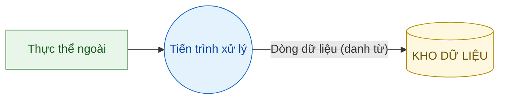

> ✅ Toàn bộ sơ đồ dùng **Mermaid thuần** (không HTML) — tương thích draw.io, VS Code, GitHub, Mermaid Live.

---

## 2. Mức Context — Sơ đồ ngữ cảnh (Context Diagram)

Toàn hệ thống được xem như **một tiến trình duy nhất**, giao tiếp với các thực thể ngoài.

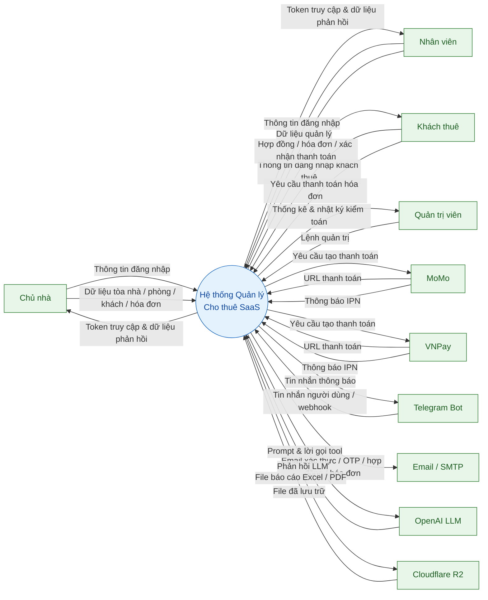

---

## 3. Mức 0 — Phân rã các tiến trình chính

Hệ thống được phân rã thành **9 tiến trình**, giao tiếp với **10 thực thể ngoài** và đọc/ghi **16 kho dữ liệu** (collection MongoDB).

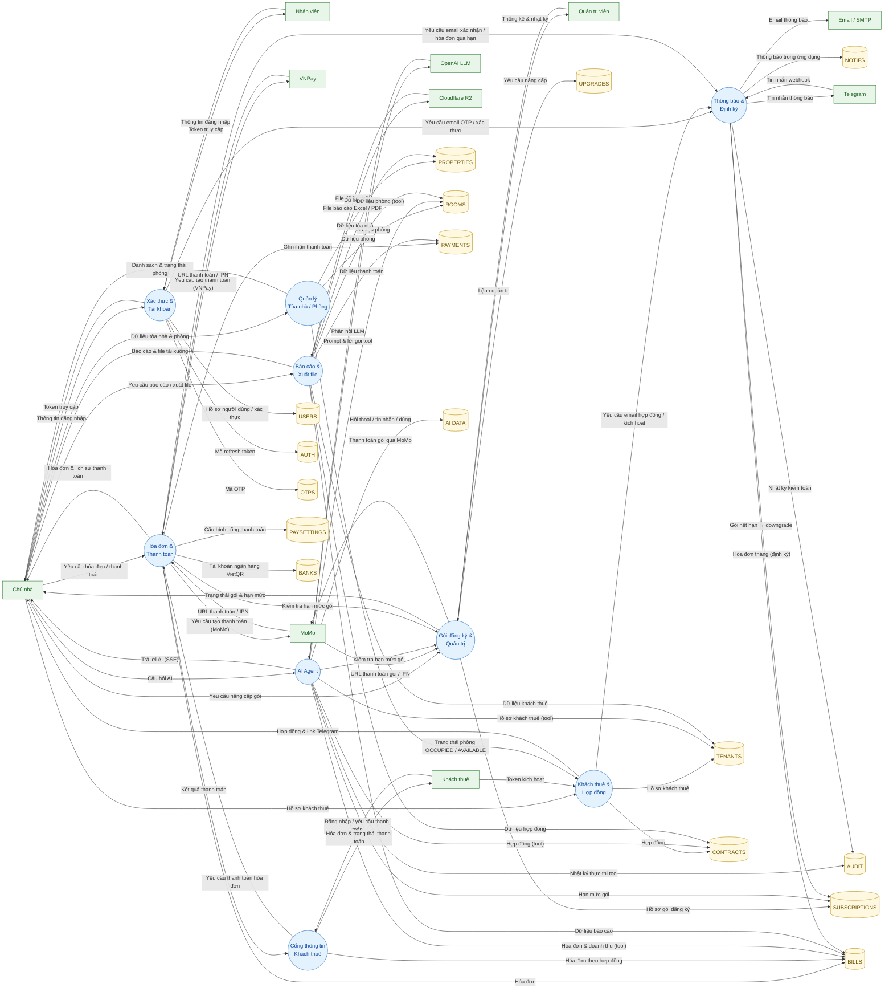

> 📌 **Kho dữ liệu**: `USERS`, `AUTH`, `OTPS`, `PROPERTIES`, `ROOMS`, `TENANTS`, `CONTRACTS`, `BILLS`, `PAYMENTS`, `PAYSETTINGS`, `SUBSCRIPTIONS`, `UPGRADES`, `BANKS`, `NOTIFS`, `AUDIT`, `AI DATA`.

---
## 4. Mức 1 — Chi tiết luồng quan trọng

### 4.1 Xác thực & Tài khoản

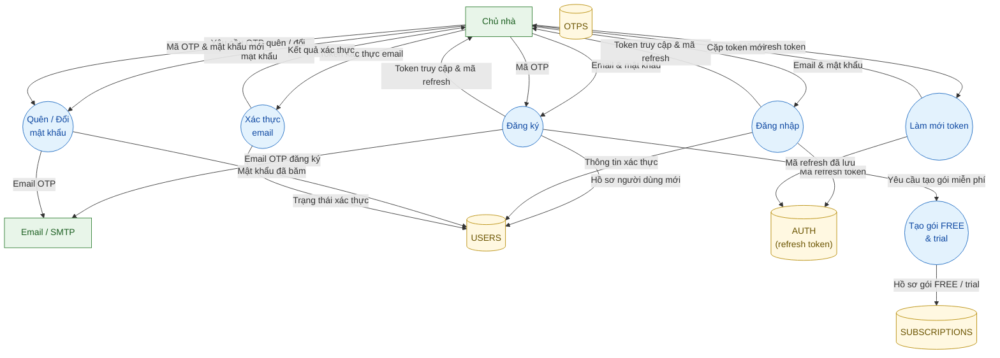

### 4.2 Hợp đồng & Kích hoạt khách thuê

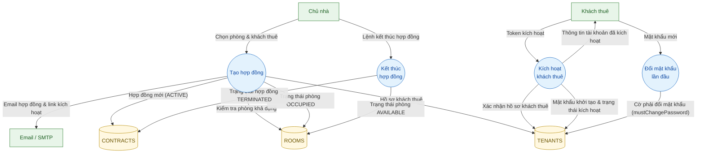

### 4.3 Hóa đơn & Thanh toán (MoMo / VNPay / VietQR / IPN)

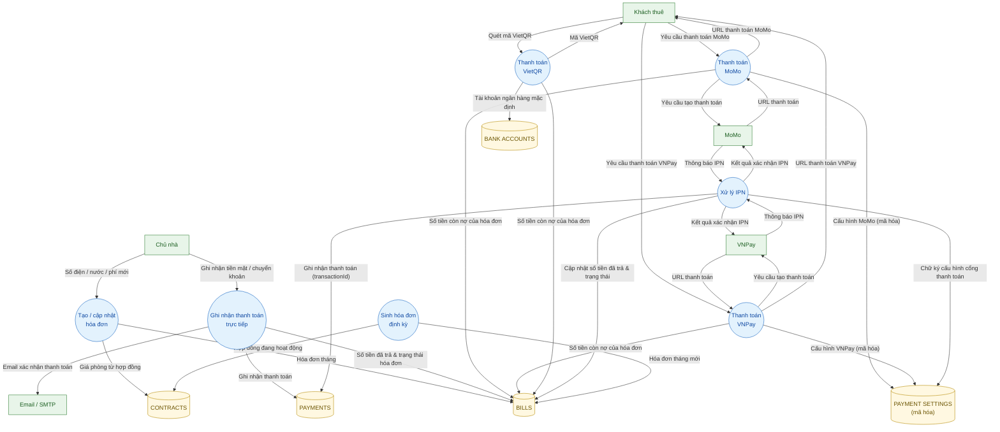

### 4.4 Gói đăng ký & Nâng cấp

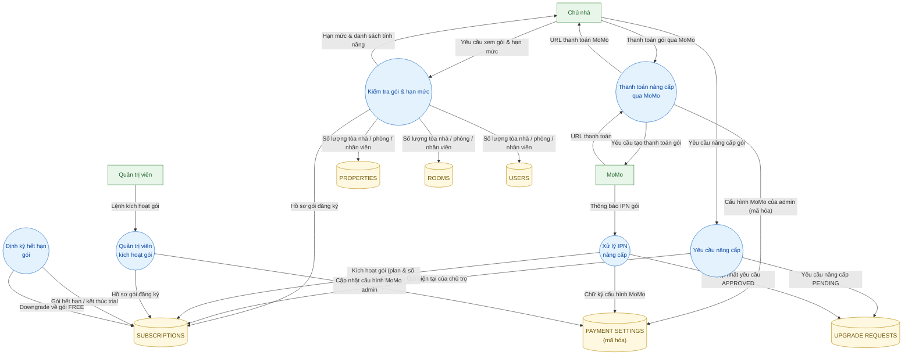

### 4.5 AI Agent (LLM + Tool Execution)

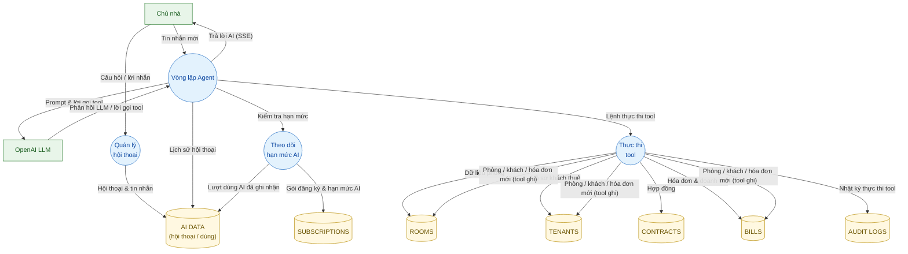

### 4.6 Cổng thông tin Khách thuê

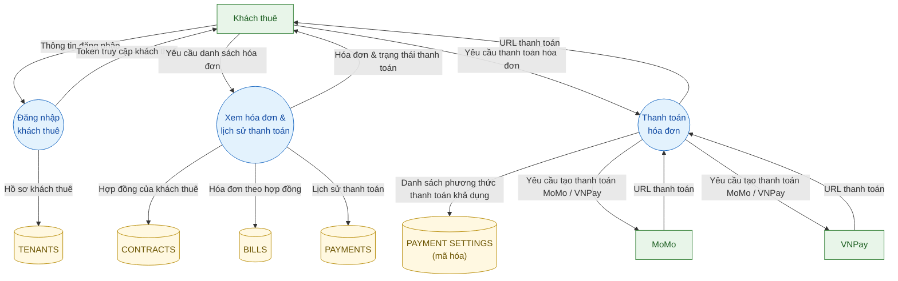

---

## 5. Mức 2 — Chi tiết luồng con

### 5.1 Luồng Đăng ký & Đăng nhập (OTP + Token)

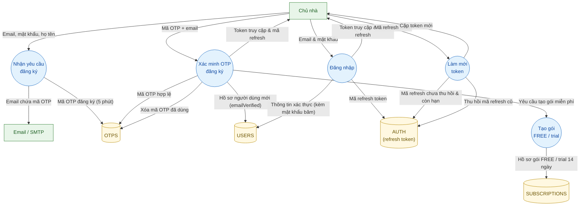

### 5.2 Luồng Thanh toán hóa đơn qua MoMo (tạo + IPN)

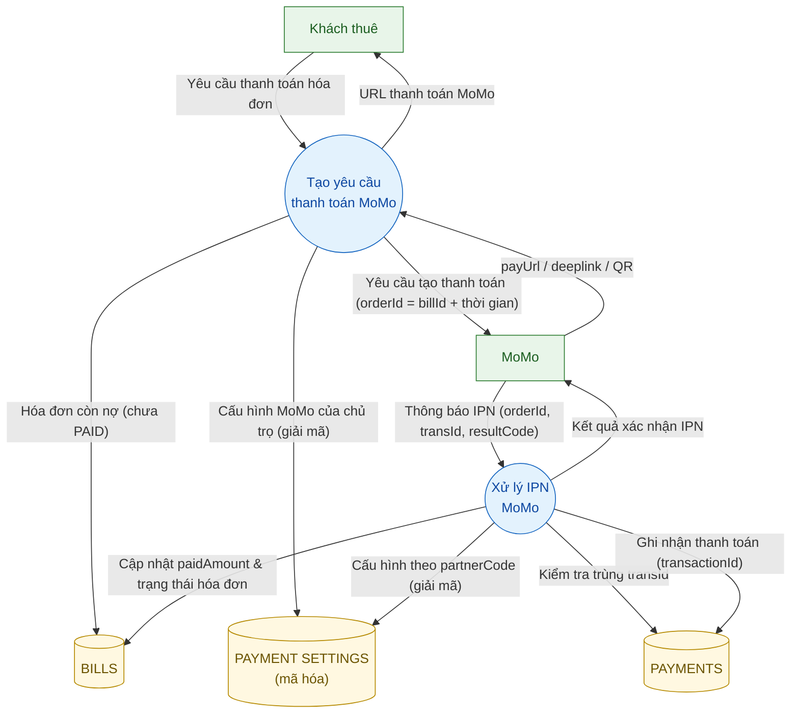

### 5.3 Luồng Thanh toán hóa đơn qua VNPay (tạo + IPN + return)

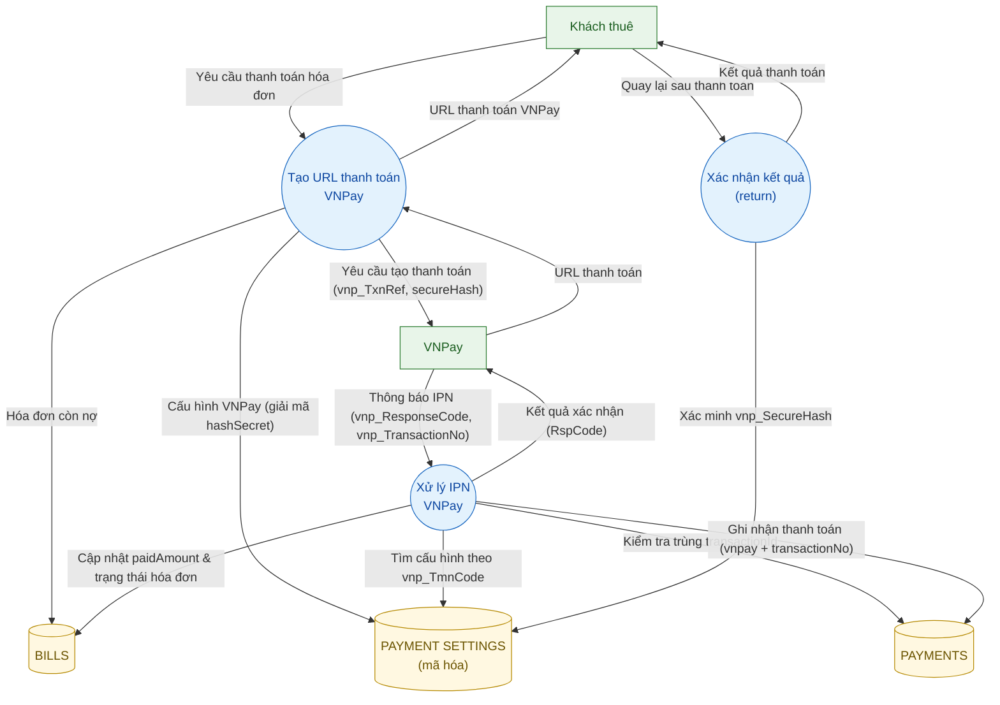

### 5.4 Luồng Nâng cấp gói qua MoMo (tạo + IPN)

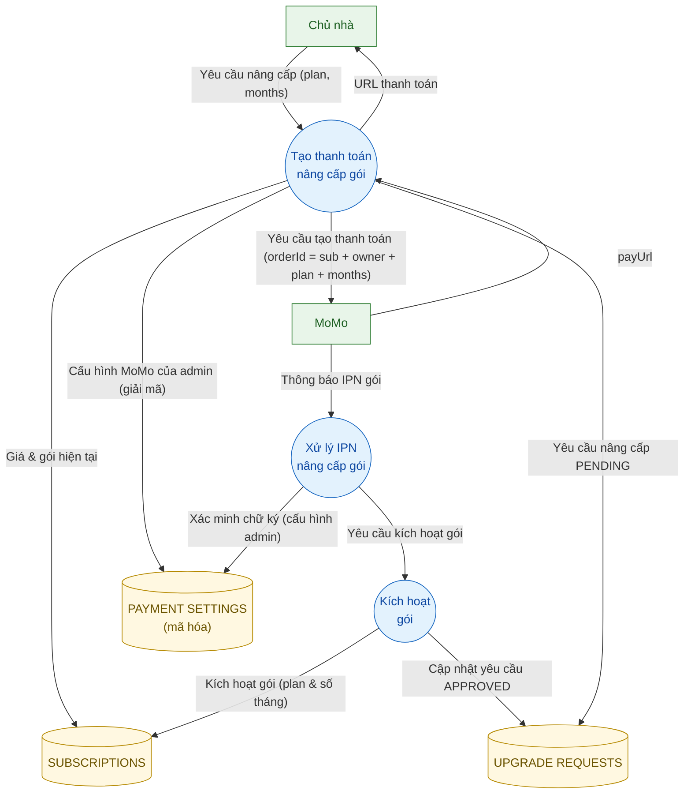

### 5.5 Vòng lặp AI Agent & Thực thi tool

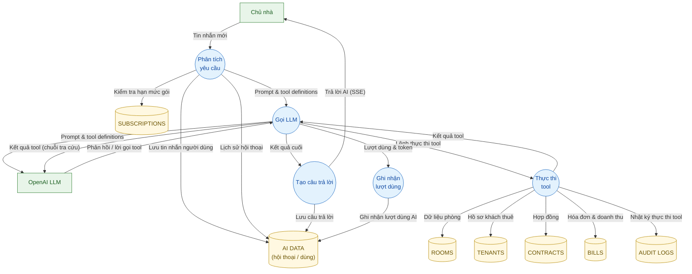

---

## 6. Ánh xạ DFD → Module / Collection

| DFD | Nhóm module | Collection MongoDB |
|---|---|---|
| P1 — Xác thực & Tài khoản | `auth`, `users`, `tenant-auth` | `users`, `auth` (refresh token), `otps`, `tenanttokens` |
| P2 — Tòa nhà / Phòng | `properties`, `rooms` | `properties`, `rooms` |
| P3 — Khách thuê & Hợp đồng | `tenants`, `contracts` | `tenants`, `contracts` |
| P4 — Hóa đơn & Thanh toán | `bills`, `payments`, `momo`, `vnpay`, `bank-accounts`, `payment-settings` | `bills`, `payments`, `paymentsettings`, `bankaccounts` |
| P5 — Gói đăng ký & Quản trị | `subscription`, `admin`, `onboarding` | `subscriptions`, `upgraderequests` |
| P6 — Cổng thông tin Khách thuê | `tenant-portal` | — (đọc qua `bills`, `payments`) |
| P7 — AI Agent | `ai-agent` | `conversations`, `messages`, `toolexecutions`, `aiusages` |
| P8 — Báo cáo & Xuất file | `report`, `analytics`, `invoice` | (đọc tổng hợp + file trên R2) |
| P9 — Thông báo & Định kỳ | `telegram`, `mail`, `notifications`, `cron`, `audit` | `notifications`, `auditlogs` |
