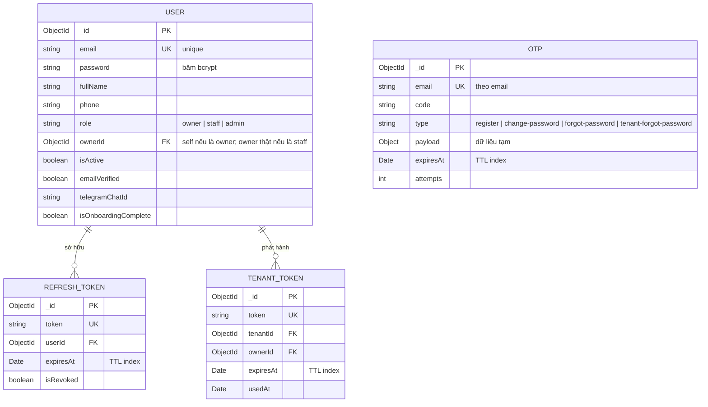
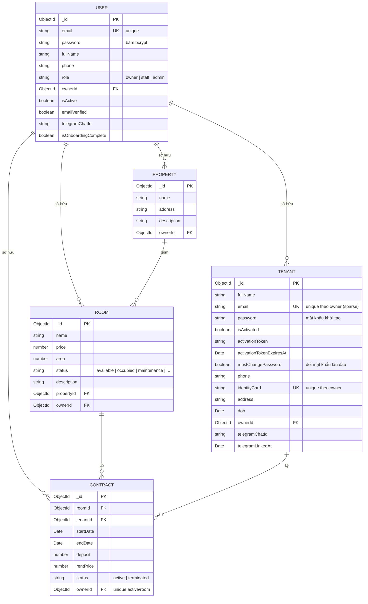
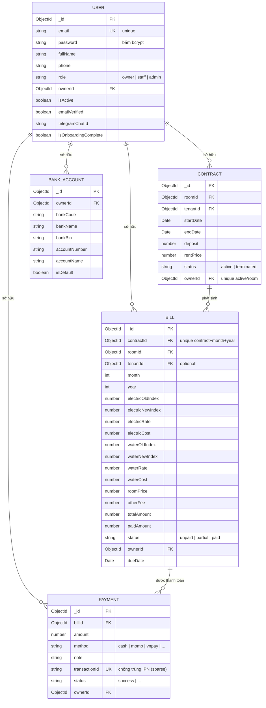
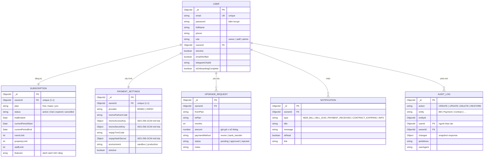
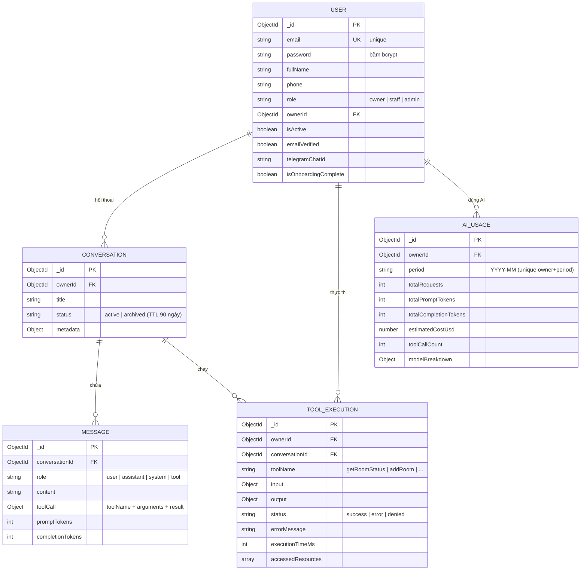

# 🗄️ Entity-Relationship Diagram (ERD) — Hệ thống Quản lý Cho thuê SaaS

> ERD mô tả các **thực thể (collection MongoDB)** và **quan hệ** của `rental-saas-backend`.
> Do hệ thống có 20 thực thể, ERD được tách thành **5 nhóm** để dễ đọc — mỗi nhóm tự chứa (USER lặp lại làm trung tâm).
> Dùng **Mermaid thuần** (`erDiagram`) — tương thích draw.io, VS Code, GitHub, Mermaid Live.

---

## 1. Ký hiệu quan hệ (Crow's Foot)

| Ký hiệu | Ý nghĩa |
|---|---|
| `\|` `\|\|` | Đúng một (exactly one) |
| `o` | Không hoặc một (zero or one) |
| `{` | Không hoặc nhiều (zero or many) |
| `}` | Một hoặc nhiều (one or many) |

Ví dụ: `USER \|\|--o{ BILL : "sở hữu"` = **1 user có 0..n hóa đơn**.

---

## 2. ERD theo nhóm

### 2.1 Xác thực & Tài khoản

### 2.2 BĐS — Khách thuê — Hợp đồng

### 2.3 Hóa đơn & Thanh toán

### 2.4 Gói đăng ký — Cấu hình — Hệ thống

### 2.5 AI Agent

---

## 3. Ánh xạ Thực thể → Collection MongoDB

| Thực thể | Collection | Nhóm |
|---|---|---|
| USER | `users` | — (trung tâm) |
| REFRESH_TOKEN | `auth` (refresh tokens) | 2.1 |
| OTP | `otps` | 2.1 |
| TENANT_TOKEN | `tenanttokens` | 2.1 |
| PROPERTY | `properties` | 2.2 |
| ROOM | `rooms` | 2.2 |
| TENANT | `tenants` | 2.2 |
| CONTRACT | `contracts` | 2.2 / 2.3 |
| BILL | `bills` (soft-delete) | 2.3 |
| PAYMENT | `payments` (soft-delete) | 2.3 |
| BANK_ACCOUNT | `bankaccounts` | 2.3 |
| SUBSCRIPTION | `subscriptions` | 2.4 |
| UPGRADE_REQUEST | `upgraderequests` | 2.4 |
| PAYMENT_SETTINGS | `paymentsettings` | 2.4 |
| NOTIFICATION | `notifications` | 2.4 |
| AUDIT_LOG | `auditlogs` | 2.4 |
| CONVERSATION | `conversations` | 2.5 |
| MESSAGE | `messages` | 2.5 |
| TOOL_EXECUTION | `toolexecutions` | 2.5 |
| AI_USAGE | `aiusages` | 2.5 |

> **Ghi chú:**
> - Quan hệ `USER → USER` (nhân viên thuộc chủ trọ qua `ownerId`) không thể hiện trên sơ đồ do `erDiagram` không hỗ trợ self-reference đẹp — xem cột `ownerId FK` của `USER`.
> - Mỗi diagram nhóm chỉ vẽ quan hệ **trong nhóm**; các FK trỏ sang thực thể nhóm khác vẫn hiển thị dưới dạng cột (VD: `BILL.roomId` → ROOM ở nhóm 2.2).
