# 🧩 Use Case Diagram (UML) — Hệ thống Quản lý Cho thuê SaaS

> Sơ đồ use case mô tả **các chức năng hệ thống** và **mối quan hệ với tác nhân (actor)** của `rental-saas-backend` (NestJS + MongoDB).
> Tài liệu được xây dựng trên kết quả [Information Gathering](INFORMATION_GATHERING.md) (Chương 2) và bám theo 9 tiến trình của [DFD](DFD.md) (P1 → P9); thực thể dữ liệu xem thêm [ERD](ERD.md).
> Dùng **Mermaid thuần** — tương thích draw.io, VS Code, GitHub, Mermaid Live.

---

## 1. Ký hiệu (Notation)

Vì Mermaid chưa hỗ trợ trực tiếp loại "Use Case Diagram" của UML, tài liệu dùng `flowchart` với các hình và quan hệ quy ước như sau:

| Hình / Quan hệ | Ý nghĩa | Ghi chú |
|---|---|---|
| ▭ **Hình chữ nhật xanh lá** | **Tác nhân (Actor)** | Người dùng hoặc hệ thống bên ngoài tương tác với hệ thống |
| ⭕ **Hình tròn xanh dương** | **Ca sử dụng (Use Case)** | Một chức năng hệ thống mà actor thực hiện để đạt mục tiêu |
| ─── **Nét liền** | **Liên kết (Association)** | Actor tham gia vào use case |
| ┄┄➤ **Nét đứt + nhãn «include»** | **Bao gồm** | Use case được gọi **luôn luôn** kèm use case khác |
| ┄┄➤ **Nét đứt + nhãn «extend»** | **Mở rộng** | Use case phụ được gọi **có điều kiện** khi chạy use case chính |
| ▲ **Mũi tên tam giác** | **Khái quát hóa (Generalization)** | Actor con kế thừa quyền của Actor cha — thể hiện bằng sơ đồ `classDiagram` (quan hệ `<|--`) vì Mermaid `flowchart` không hỗ trợ mũi tên tam giác UML |

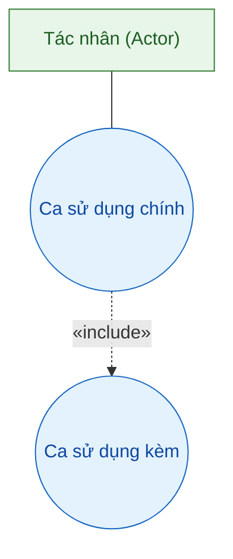

---

## 2. Danh sách Actor (Tác nhân)

### 2.1. Actor nội bộ (Internal Actors) — người dùng

| **Actor** | **Vai trò** | **Chức năng chính** |
|---|---|---|
| **Chủ nhà (Owner)** | Chủ doanh nghiệp MinhHouse (4 tòa, 25 phòng); toàn quyền trên dữ liệu | Quản lý tòa nhà/phòng, khách thuê, hợp đồng, hóa đơn, gói đăng ký, AI Agent, báo cáo |
| **Nhân viên (Staff)** | Nhân viên quản lý do chủ nhà tạo; quyền hạn hẹp hơn Owner | Nhập chỉ số điện/nước, tạo/cập nhật hóa đơn, ghi nhận thanh toán, xem phòng & thông báo |
| **Khách thuê (Tenant)** | Người thuê phòng; tài khoản riêng do hệ thống cấp khi ký hợp đồng | Kích hoạt tài khoản, xem hóa đơn & lịch sử thanh toán, thanh toán online |
| **Quản trị viên (Admin)** | Vận hành nền tảng SaaS | Quản lý gói FREE/BASIC/PRO, kích hoạt gói, quản lý người dùng, thống kê, nhật ký kiểm toán |

### 2.2. Actor bên ngoài (External Actors) — hệ thống

| **Actor** | **Loại** | **Vai trò trong hệ thống** |
|---|---|---|
| **MoMo** | Cổng thanh toán | Tạo URL thanh toán, gửi IPN xác nhận khi khách/thuê gói thanh toán thành công |
| **VNPay** | Cổng thanh toán | Tạo URL thanh toán, gửi IPN + redirect kết quả thanh toán |
| **Telegram Bot** | Kênh thông báo | Nhận lệnh gửi tin nhắn, nhận webhook khi chủ nhà liên kết tài khoản |
| **Email / SMTP** | Kênh thông báo | Gửi email OTP đăng ký, email hợp đồng + link kích hoạt, email xác nhận thanh toán |
| **OpenAI LLM** | AI | Nhận prompt & lời gọi tool, trả phản hồi cho AI Agent |
| **Cloudflare R2** | Lưu trữ file | Lưu file báo cáo Excel / hóa đơn PDF đã xuất |

### 2.3. Khái quát hóa Actor (Generalization)

Trong ERD, `Chủ nhà`, `Nhân viên`, `Quản trị viên` đều là **User** (trường `role`), còn **Khách thuê** là thực thể riêng (`tenants`) nên không nằm trong quan hệ khái quát hóa này.

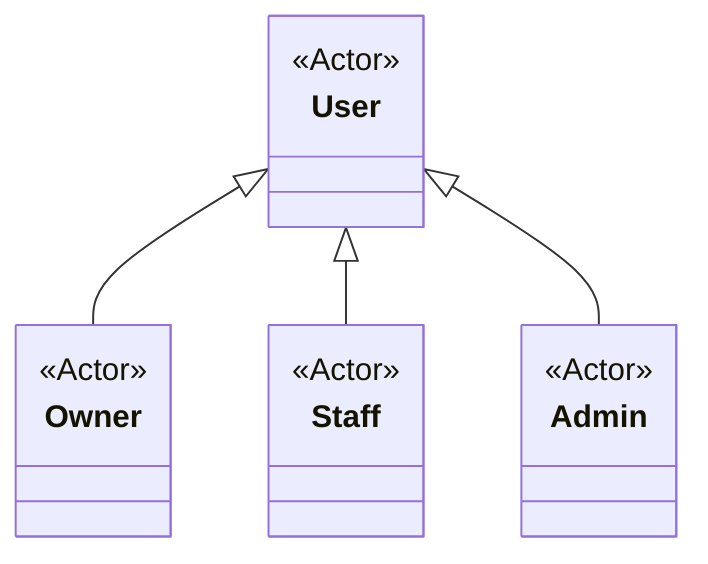

---

## 3. Sơ đồ Use Case

### 3.1. Sơ đồ tổng thể (mức hệ thống)

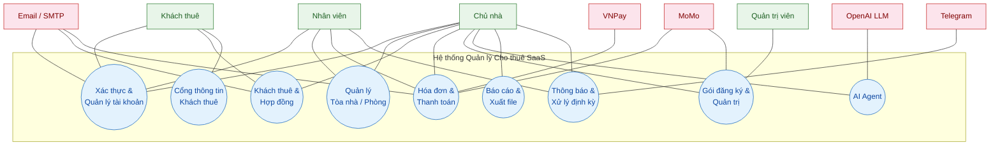

### 3.2. Nhóm Xác thực & Tài khoản (P1)

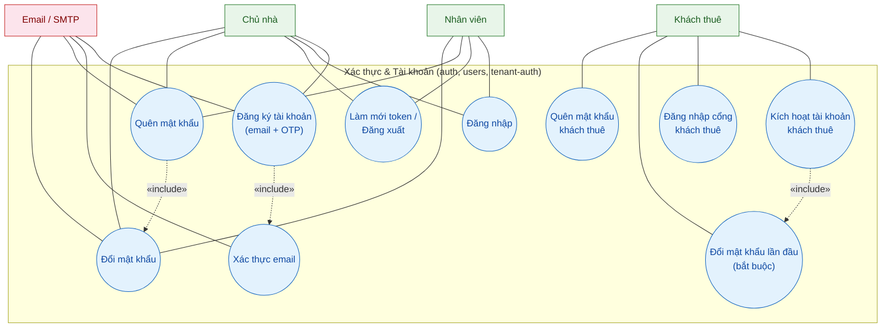

### 3.3. Nhóm Quản lý Tòa nhà / Phòng (P2)

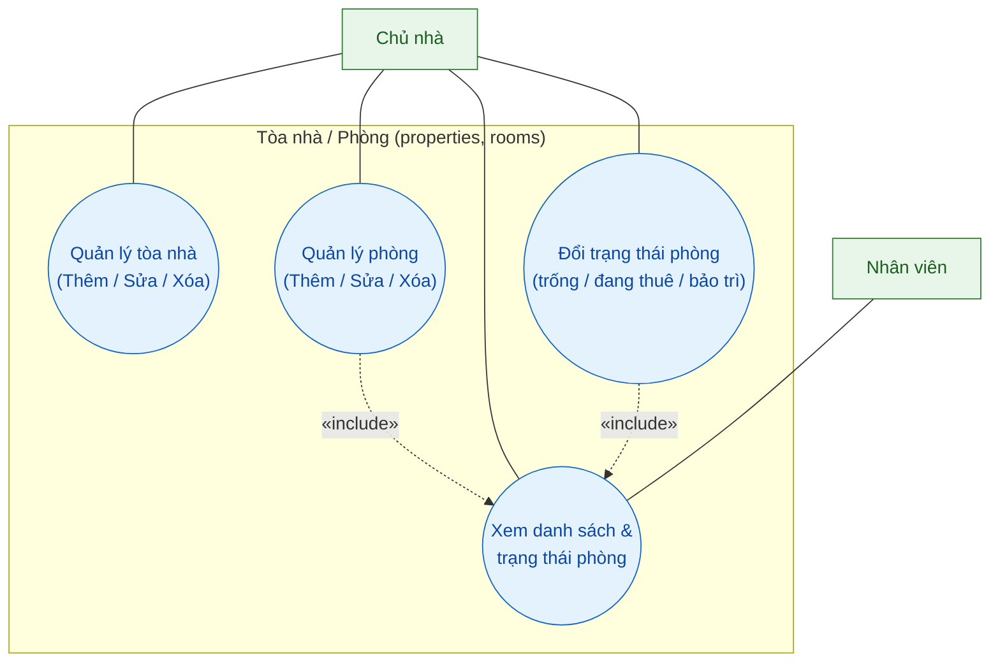

### 3.4. Nhóm Khách thuê & Hợp đồng (P3)

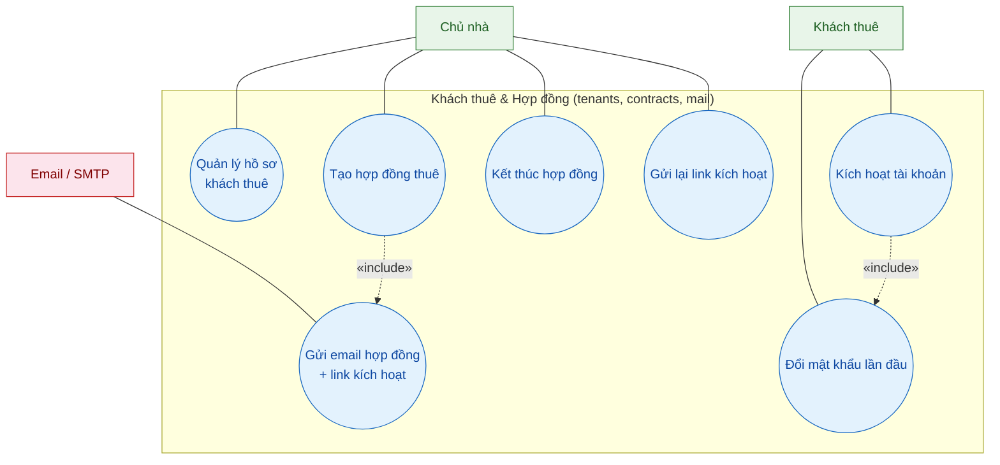

### 3.5. Nhóm Hóa đơn & Thanh toán (P4)

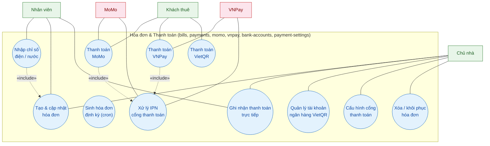

### 3.6. Nhóm Gói đăng ký & Quản trị (P5)

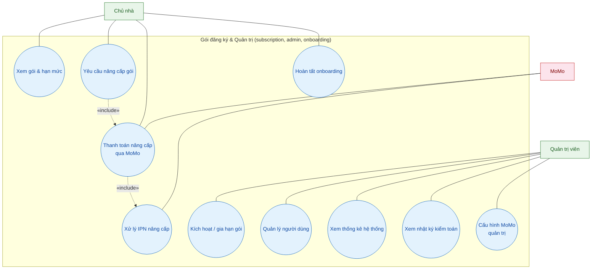

### 3.7. Nhóm Cổng thông tin Khách thuê (P6)

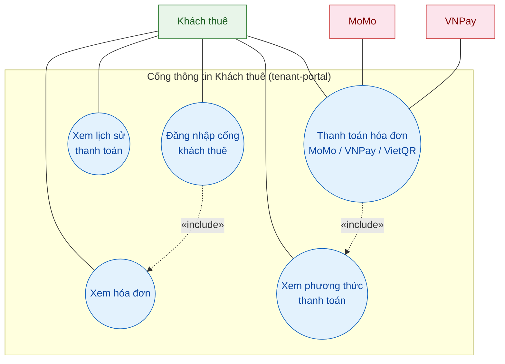

### 3.8. Nhóm AI Agent (P7)

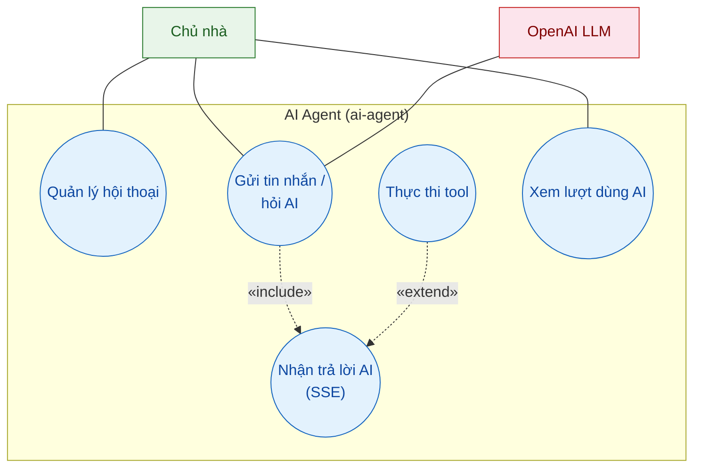

### 3.9. Nhóm Báo cáo & Xuất file (P8)

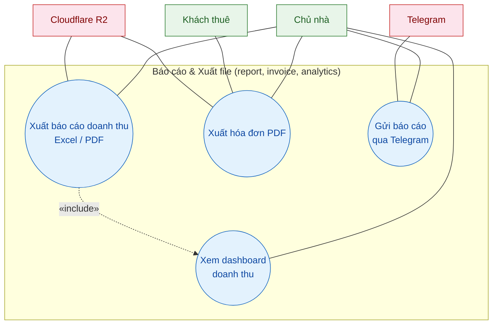

### 3.10. Nhóm Thông báo & Xử lý định kỳ (P9)

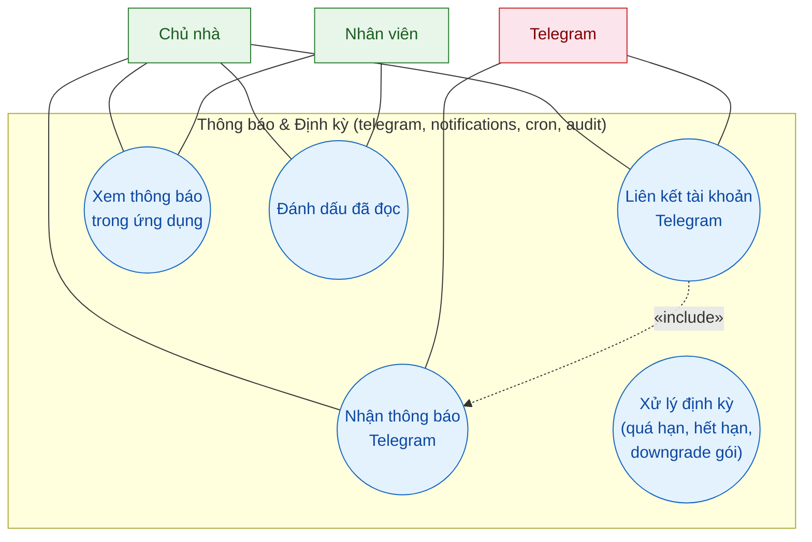

---

## 4. Bảng tổng hợp Use Case → Actor → Module → DFD

| **UC** | **Use Case** | **Actor** | **Module** | **DFD** |
|---|---|---|---|---|
| UC-01 | Đăng ký tài khoản (email + OTP) | Chủ nhà | `auth`, `users`, `subscription` | P1 |
| UC-02 | Xác thực email | Chủ nhà | `auth` | P1 |
| UC-03 | Đăng nhập / Làm mới token / Đăng xuất | Chủ nhà, Nhân viên | `auth` | P1 |
| UC-04 | Quên / Đổi mật khẩu | Chủ nhà, Nhân viên | `auth` | P1 |
| UC-05 | Kích hoạt tài khoản & đổi mật khẩu lần đầu | Khách thuê | `tenant-auth` | P1/P3 |
| UC-06 | Đăng nhập cổng khách thuê | Khách thuê | `tenant-auth`, `tenant-portal` | P1/P6 |
| UC-07 | Quản lý tòa nhà | Chủ nhà | `properties` | P2 |
| UC-08 | Quản lý phòng & trạng thái phòng | Chủ nhà, Nhân viên | `rooms` | P2 |
| UC-09 | Quản lý hồ sơ khách thuê | Chủ nhà | `tenants` | P3 |
| UC-10 | Tạo hợp đồng & gửi email kích hoạt | Chủ nhà | `contracts`, `mail` | P3 |
| UC-11 | Kết thúc hợp đồng | Chủ nhà | `contracts` | P3 |
| UC-12 | Nhập chỉ số điện/nước & tạo hóa đơn | Nhân viên, Chủ nhà | `bills` | P4 |
| UC-13 | Ghi nhận thanh toán trực tiếp | Chủ nhà, Nhân viên | `payments` | P4 |
| UC-14 | Thanh toán hóa đơn online (MoMo/VNPay/VietQR) | Khách thuê | `momo`, `vnpay`, `bank-accounts`, `tenant-portal` | P4/P6 |
| UC-15 | Xử lý IPN cổng thanh toán | MoMo, VNPay | `momo`, `vnpay`, `payments` | P4 |
| UC-16 | Cấu hình cổng thanh toán & tài khoản ngân hàng | Chủ nhà | `payment-settings`, `bank-accounts` | P4 |
| UC-17 | Xem gói & hạn mức | Chủ nhà | `subscription` | P5 |
| UC-18 | Nâng cấp gói đăng ký | Chủ nhà | `subscription` | P5 |
| UC-19 | Quản trị hệ thống (người dùng, thống kê, nhật ký) | Quản trị viên | `admin`, `audit` | P5 |
| UC-20 | Xem hóa đơn & lịch sử thanh toán | Khách thuê | `tenant-portal` | P6 |
| UC-21 | Hỏi AI Agent | Chủ nhà | `ai-agent` | P7 |
| UC-22 | Xem dashboard & báo cáo doanh thu | Chủ nhà | `analytics`, `report` | P8 |
| UC-23 | Xuất file Excel / PDF | Chủ nhà, Khách thuê | `report`, `invoice` | P8 |
| UC-24 | Nhận thông báo Telegram / trong ứng dụng | Chủ nhà, Nhân viên | `telegram`, `notifications` | P9 |
| UC-25 | Xử lý định kỳ (quá hạn, hết hạn, downgrade) | Hệ thống (cron) | `cron`, `audit` | P9 |

---

## 5. Kịch bản Use Case chi tiết (Use Case Scenario)

### 5.1. UC-01 — Đăng ký tài khoản

| **Trường** | **Nội dung** |
|---|---|
| **Tên Use Case** | Đăng ký tài khoản Chủ nhà (email + OTP) |
| **Actor chính** | Chủ nhà |
| **Actor phụ** | Email / SMTP, Hệ thống (tạo gói FREE) |
| **Mô tả** | Chủ nhà tạo tài khoản bằng email + mật khẩu, xác nhận qua mã OTP gửi email, hệ thống tự cấp gói FREE/trial |
| **Tiền điều kiện** | Email chưa được đăng ký |
| **Hậu điều kiện** | Tài khoản được tạo (emailVerified), gói FREE/trial được cấp |
| **Dòng sự kiện chính** | 1. Chủ nhà nhập email, mật khẩu, họ tên → 2. Hệ thống gửi OTP qua email → 3. Chủ nhà nhập mã OTP → 4. Hệ thống xác minh, tạo người dùng và gói FREE/trial 14 ngày → 5. Hệ thống trả token truy cập & refresh |
| **Ngoại lệ** | 4a. OTP sai/quá hạn → báo lỗi, yêu cầu nhập lại hoặc gửi lại; 2a. Email đã tồn tại → báo lỗi ngay từ bước 1 |

### 5.2. UC-03 — Đăng nhập

| **Trường** | **Nội dung** |
|---|---|
| **Tên Use Case** | Đăng nhập & làm mới phiên |
| **Actor chính** | Chủ nhà, Nhân viên |
| **Actor phụ** | Không có |
| **Mô tả** | Người dùng xác thực bằng email/mật khẩu; hệ thống cấp token truy cập và refresh token, hỗ trợ làm mới phiên khi hết hạn |
| **Tiền điều kiện** | Tài khoản tồn tại và hoạt động |
| **Hậu điều kiện** | Phiên làm việc hợp lệ; refresh token cũ bị thu hồi khi làm mới |
| **Dòng sự kiện chính** | 1. Nhập email & mật khẩu → 2. Hệ thống kiểm tra thông tin xác thực → 3. Cấp cặp token → 4. Khi token hết hạn, gửi refresh token → 5. Hệ thống thu hồi refresh cũ và cấp cặp mới |
| **Ngoại lệ** | 2a. Sai mật khẩu → báo lỗi; 4a. Refresh token đã thu hồi/hết hạn → yêu cầu đăng nhập lại |

### 5.3. UC-10 — Tạo hợp đồng & kích hoạt khách thuê

| **Trường** | **Nội dung** |
|---|---|
| **Tên Use Case** | Tạo hợp đồng thuê & gửi email kích hoạt |
| **Actor chính** | Chủ nhà |
| **Actor phụ** | Email / SMTP, Khách thuê |
| **Mô tả** | Chủ nhà chọn phòng + khách thuê, lập hợp đồng (giá, cọc, thời hạn); hệ thống gửi email kèm link kích hoạt để khách tạo tài khoản |
| **Tiền điều kiện** | Phòng đang trống; hồ sơ khách thuê đã có |
| **Hậu điều kiện** | Hợp đồng ACTIVE, phòng chuyển OCCUPIED; khách nhận email kích hoạt |
| **Dòng sự kiện chính** | 1. Chọn phòng & khách thuê → 2. Hệ thống kiểm tra phòng khả dụng → 3. Lưu hợp đồng, đổi trạng thái phòng → 4. Gửi email hợp đồng + link kích hoạt → 5. Khách mở link, đặt mật khẩu (bắt buộc đổi mật khẩu lần đầu) → 6. Tài khoản khách kích hoạt |
| **Ngoại lệ** | 2a. Phòng đang thuê/bảo trì → từ chối; 5a. Link hết hạn → Chủ nhà gửi lại link kích hoạt |

### 5.4. UC-12 — Nhập chỉ số & sinh hóa đơn

| **Trường** | **Nội dung** |
|---|---|
| **Tên Use Case** | Nhập chỉ số điện/nước và tạo hóa đơn tháng |
| **Actor chính** | Nhân viên (hoặc Chủ nhà) |
| **Actor phụ** | Hệ thống (sinh định kỳ) |
| **Mô tả** | Nhân viên nhập chỉ số điện/nước đầu kỳ & cuối kỳ; hệ thống tự tính tiền theo giá phòng trong hợp đồng và tạo hóa đơn |
| **Tiền điều kiện** | Hợp đồng đang hoạt động cho phòng |
| **Hậu điều kiện** | Hóa đơn mới (UNPAID) được tạo với tổng tiền tính tự động |
| **Dòng sự kiện chính** | 1. Nhập chỉ số điện/nước → 2. Hệ thống tính điện/nước + giá phòng + phí khác → 3. Tạo hóa đơn tháng → 4. (Tùy chọn) hệ thống nhắc hạn thanh toán |
| **Ngoại lệ** | 2a. Chỉ số cuối nhỏ hơn đầu kỳ → cảnh báo; 3a. Đã tồn tại hóa đơn tháng → chặn trùng |

### 5.5. UC-14 — Thanh toán hóa đơn online (MoMo)

| **Trường** | **Nội dung** |
|---|---|
| **Tên Use Case** | Thanh toán hóa đơn qua MoMo / VNPay / VietQR |
| **Actor chính** | Khách thuê |
| **Actor phụ** | MoMo, VNPay (IPN), Hệ thống |
| **Mô tả** | Khách chọn hóa đơn còn nợ và thanh toán online; hệ thống tạo yêu cầu thanh toán và ghi nhận khi cổng thanh toán gửi IPN |
| **Tiền điều kiện** | Khách đã đăng nhập cổng; hóa đơn chưa PAID |
| **Hậu điều kiện** | Ghi nhận thanh toán (transactionId chống trùng), paidAmount & trạng thái hóa đơn được cập nhật |
| **Dòng sự kiện chính** | 1. Chọn hóa đơn & phương thức → 2. Hệ thống đọc cấu hình cổng (giải mã) → 3. Tạo yêu cầu thanh toán, trả URL → 4. Khách thanh toán trên cổng → 5. Cổng gửi IPN → 6. Hệ thống xác minh chữ ký, ghi nhận thanh toán, cập nhật hóa đơn → 7. Xác nhận IPN về cổng |
| **Ngoại lệ** | 5a. IPN trùng transactionId → bỏ qua, không ghi trùng; 2a. Chủ nhà chưa cấu hình cổng → thông báo chưa khả dụng |

### 5.6. UC-20 — Xem hóa đơn & lịch sử thanh toán

| **Trường** | **Nội dung** |
|---|---|
| **Tên Use Case** | Xem hóa đơn & lịch sử thanh toán trên cổng khách thuê |
| **Actor chính** | Khách thuê |
| **Actor phụ** | Không có |
| **Mô tả** | Khách xem danh sách hóa đơn theo hợp đồng và lịch sử các lần thanh toán |
| **Tiền điều kiện** | Khách đã đăng nhập cổng thông tin |
| **Hậu điều kiện** | Hiển thị hóa đơn & trạng thái thanh toán tương ứng |
| **Dòng sự kiện chính** | 1. Đăng nhập cổng → 2. Chọn xem hóa đơn → 3. Hệ thống lấy hợp đồng của khách → 4. Trả danh sách hóa đơn & lịch sử thanh toán |
| **Ngoại lệ** | 3a. Không có hợp đồng/kỳ hóa đơn → hiển thị danh sách rỗng |

### 5.7. UC-18 — Nâng cấp gói đăng ký

| **Trường** | **Nội dung** |
|---|---|
| **Tên Use Case** | Nâng cấp gói đăng ký (FREE → BASIC/PRO) |
| **Actor chính** | Chủ nhà |
| **Actor phụ** | MoMo, Quản trị viên |
| **Mô tả** | Chủ nhà chọn gói và số tháng, thanh toán qua MoMo; khi nhận IPN thành công hệ thống kích hoạt gói mới |
| **Tiền điều kiện** | Chủ nhà có gói hiện tại; cấu hình MoMo của quản trị hoạt động |
| **Hậu điều kiện** | Gói mới được kích hoạt (plan & số tháng), yêu cầu nâng cấp APPROVED |
| **Dòng sự kiện chính** | 1. Chọn gói & số tháng → 2. Hệ thống tạo yêu cầu nâng cấp PENDING → 3. Tạo thanh toán MoMo, trả URL → 4. Chủ nhà thanh toán → 5. MoMo gửi IPN → 6. Xác minh chữ ký, kích hoạt gói, cập nhật yêu cầu APPROVED |
| **Ngoại lệ** | 5a. IPN thất bại → yêu cầu vẫn PENDING, không kích hoạt gói; 6a. Quản trị viên có thể kích hoạt/gia hạn gói thủ công |

### 5.8. UC-21 — Hỏi AI Agent

| **Trường** | **Nội dung** |
|---|---|
| **Tên Use Case** | Hỏi AI Agent về trạng thái phòng/khách/doanh thu |
| **Actor chính** | Chủ nhà |
| **Actor phụ** | OpenAI LLM |
| **Mô tả** | Chủ nhà đặt câu hỏi tự nhiên; Agent gọi LLM, tùy chọn thực thi tool truy cập dữ liệu phòng/khách/hợp đồng/hóa đơn và trả lời dạng stream (SSE) |
| **Tiền điều kiện** | Gói còn hạn mức AI; đã có hội thoại (tạo mới nếu chưa) |
| **Hậu điều kiện** | Lưu tin nhắn & câu trả lời, ghi nhận lượt dùng AI, ghi nhật ký thực thi tool |
| **Dòng sự kiện chính** | 1. Gửi tin nhắn → 2. Kiểm tra hạn mức gói → 3. Gửi prompt + tool definitions cho LLM → 4. (Điều kiện) LLM yêu cầu tool → thực thi, đưa kết quả vào chuỗi tra cứu → 5. Tạo câu trả lời và stream về (SSE) |
| **Ngoại lệ** | 2a. Hết hạn mức → từ chối, gợi ý nâng cấp; 4a. Tool từ chối (thiếu quyền/dữ liệu) → trả lời dựa trên dữ liệu có sẵn |

---

> **Liên kết tài liệu:** Sơ đồ use case được xây dựng từ kết quả **[Information Gathering](INFORMATION_GATHERING.md)** (Chương 2), khớp với **[DFD](DFD.md)** (9 tiến trình P1–P9) và **[ERD](ERD.md)** (20 thực thể MongoDB) của hệ thống `rental-saas-backend`.
