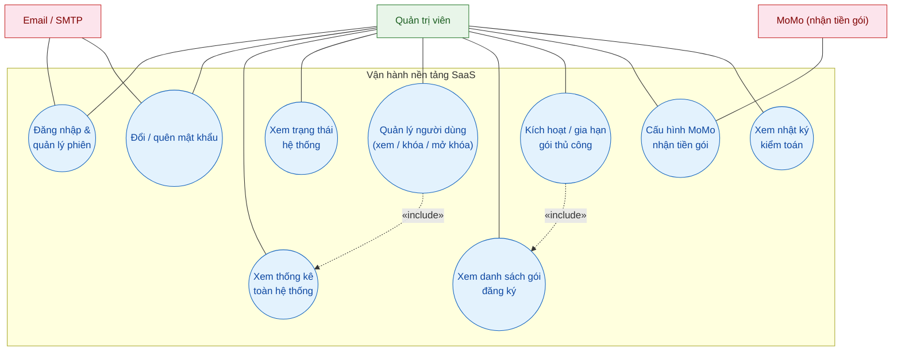

# 👤 Quản trị viên (Admin) — Danh sách Use Case

> Tài liệu riêng cho actor **Quản trị viên**, đọc trực tiếp từ mã nguồn `rental-saas-backend` (NestJS + MongoDB).
> Dùng để vẽ sơ đồ use case **từng actor một**; sau đó gộp các actor lại thành sơ đồ tổng thể trong `USECASE.md`.
> Quyền ADMIN được gắn bằng `@Roles(Role.ADMIN)` trên các controller: **`admin`** và **`subscription`** (+ chức năng tài khoản dùng chung `auth`).

---

## 0. Vị trí của Admin trong hệ thống

**Quản trị viên ≠ người dùng tính năng quản lý trọ.** Admin thuộc **phía vận hành nền tảng SaaS** — họ không quản lý phòng/hợp đồng/hóa đơn của bất kỳ nhà trọ nào, mà quản lý **các chủ trọ đang thuê nền tảng**: gói đăng ký, người dùng, thống kê, cấu hình nhận tiền thuê gói.

```
        ┌─────────────────────────────────────────────┐
        │  NHÀ CUNG CẤP SaaS (vận hành nền tảng)       │
        │   → Quản trị viên (Admin)                    │
        └──────────────┬──────────────────────────────┘
                       │ quản lý gói, người dùng, thống kê
        ┌──────────────▼──────────────────────────────┐
        │  KHÁCH HÀNG THUÊ SaaS (Chủ trọ)              │
        │   → Chủ nhà (Owner) + Nhân viên (Staff)      │
        └─────────────────────────────────────────────┘
```

> 📌 **Ghi chú thiết kế (đã trao đổi):** Nếu sau này bạn **chỉ giữ 2 role là `quản trị viên` + `nhân viên`** (bỏ `owner`), thì phần "Nhân viên" sẽ **hấp thụ toàn bộ tính năng quản lý trọ của Chủ nhà** hiện tại. Danh sách Admin dưới đây **không đổi** — vì dù gộp hay không, Admin vẫn chỉ làm việc trên nền tảng. Xem chi tiết mục 6.

---

## 1. Bảng tổng hợp Use Case

| **UC** | **Use Case** | **Endpoint** | **Mô tả ngắn** | **Module** |
|---|---|---|---|---|
| UC-A1 | Đăng nhập & quản lý phiên | `POST /auth/login`, `POST /auth/refresh`, `POST /auth/logout` | Đăng nhập, làm mới token, đăng xuất | `auth` |
| UC-A2 | Xem hồ sơ & đổi mật khẩu | `GET /auth/profile`, `POST /auth/change-password/*` | Xem thông tin tài khoản, đổi mật khẩu | `auth` |
| UC-A3 | Quên mật khẩu | `POST /auth/forgot-password/*` | Lấy lại mật khẩu qua OTP email | `auth` |
| UC-A4 | Xem thống kê toàn hệ thống | `GET /admin/stats` | Tổng user, phòng, hóa đơn, doanh thu, phân bố gói, user mới | `admin` |
| UC-A5 | Xem trạng thái hệ thống | `GET /admin/health` | Số lượng DB, memory, uptime, phiên bản Node | `admin` |
| UC-A6 | Xem danh sách người dùng | `GET /admin/users` | Phân trang, tìm kiếm, lọc theo role | `admin` |
| UC-A7 | Xem chi tiết người dùng & gói | `GET /admin/users/:id` | Hồ sơ user + gói đăng ký tương ứng | `admin` |
| UC-A8 | Khóa / kích hoạt người dùng | `PATCH /admin/users/:id/toggle-active` | Bật/tắt `isActive` của tài khoản | `admin` |
| UC-A9 | Xem danh sách gói đăng ký | `GET /subscriptions` | Toàn bộ gói của mọi chủ trọ, phân trang | `subscription` |
| UC-A10 | Xem gói của một chủ trọ | `GET /subscriptions/owner/:ownerId` | Tra cứu gói theo owner | `subscription` |
| UC-A11 | Kích hoạt / gia hạn gói thủ công | `POST /subscriptions/activate` | Gán plan + số tháng + ghi chú cho chủ trọ | `subscription` |
| UC-A12 | Xem cấu hình MoMo nhận tiền gói | `GET /subscriptions/admin-payment-settings` | Kiểm tra đã cấu hình MoMo chưa (partnerCode, môi trường) | `subscription` |
| UC-A13 | Cập nhật cấu hình MoMo nhận tiền gói | `PUT /subscriptions/admin-payment-settings` | Nhập/ký lại thông tin MoMo của nền tảng (mã hóa AES) | `subscription` |
| UC-A14 | Xem nhật ký kiểm toán | `GET /audit-logs` | Tra cứu lịch sử thao tác dữ liệu | `audit` |

> **Không phải use case của Admin:**
> - `POST /seed` / `DELETE /seed` — công cụ phát triển (tạo/xóa dữ liệu demo), không phải tính năng báo cáo.
> - `POST /cron/*` — tác vụ định kỳ do hệ thống tự chạy.
> - `GET /health/healthz`, `GET /health/readyz` — health check cho hạ tầng.
> - **Admin không tạo tài khoản bằng đăng ký** — tài khoản admin được tạo từ script seed (`findAdminUser` trong subscription service).

---

## 2. Chi tiết từng Use Case

### UC-A1 — Đăng nhập & quản lý phiên
| Trường | Nội dung |
|---|---|
| **Actor chính** | Quản trị viên |
| **Mô tả** | Đăng nhập bằng email/mật khẩu, nhận cặp token, làm mới khi hết hạn, đăng xuất |
| **Tiền điều kiện** | Tài khoản admin tồn tại (do seed tạo) và `isActive = true` |
| **Hậu điều kiện** | Có phiên hợp lệ; refresh token cũ bị thu hồi khi làm mới |
| **Ngoại lệ** | Sai mật khẩu / tài khoản bị khóa → từ chối đăng nhập |

### UC-A2 — Xem hồ sơ & đổi mật khẩu
| Trường | Nội dung |
|---|---|
| **Mô tả** | Xem hồ sơ của chính admin; đổi mật khẩu qua OTP xác minh |
| **Tiền điều kiện** | Đã đăng nhập |
| **Hậu điều kiện** | Mật khẩu mới được lưu (đã băm) |

### UC-A3 — Quên mật khẩu
| Trường | Nội dung |
|---|---|
| **Mô tả** | Yêu cầu OTP gửi email → nhập OTP + mật khẩu mới |
| **Tiền điều kiện** | Email admin hợp lệ |
| **Hậu điều kiện** | Có thể đăng nhập lại với mật khẩu mới |

### UC-A4 — Xem thống kê toàn hệ thống
| Trường | Nội dung |
|---|---|
| **Mô tả** | Xem dashboard tổng: số user (owner/staff), tòa nhà, phòng, hóa đơn, tổng doanh thu, phân bố gói (FREE/BASIC/PRO), 5 user mới nhất |
| **Hậu điều kiện** | Hiển thị số liệu tổng hợp trên toàn nền tảng |

### UC-A5 — Xem trạng thái hệ thống
| Trường | Nội dung |
|---|---|
| **Mô tả** | Kiểm tra sức khỏe hệ thống: số bản ghi DB (users/bills/payments), memory, uptime, phiên bản Node |
| **Hậu điều kiện** | Trả về trạng thái `healthy` kèm thông số |

### UC-A6 — Xem danh sách người dùng
| Trường | Nội dung |
|---|---|
| **Mô tả** | Danh sách user toàn nền tảng, phân trang, tìm theo email/họ tên, lọc theo role (owner/staff/admin) |
| **Hậu điều kiện** | Trả danh sách user (ẩn password) |

### UC-A7 — Xem chi tiết người dùng & gói
| Trường | Nội dung |
|---|---|
| **Mô tả** | Xem hồ sơ một user kèm gói đăng ký hiện tại của user đó |
| **Hậu điều kiện** | Trả `{ user, subscription }` |
| **Ngoại lệ** | User không tồn tại → 404 |

### UC-A8 — Khóa / kích hoạt người dùng
| Trường | Nội dung |
|---|---|
| **Mô tả** | Bật/tắt cờ `isActive` của một tài khoản — khóa tài khoản vi phạm hoặc mở khóa lại |
| **Hậu điều kiện** | `isActive` đảo trạng thái; user bị khóa không đăng nhập được |
| **Ngoại lệ** | User không tồn tại → 404 |

### UC-A9 — Xem danh sách gói đăng ký
| Trường | Nội dung |
|---|---|
| **Mô tả** | Danh sách gói của mọi chủ trọ (kèm email/họ tên/sđt owner), phân trang; tự lọc bỏ gói mồ côi khi owner đã bị xóa |
| **Hậu điều kiện** | Trả danh sách gói phân trang |

### UC-A10 — Xem gói của một chủ trọ
| Trường | Nội dung |
|---|---|
| **Mô tả** | Tra cứu gói đăng ký theo `ownerId` |
| **Hậu điều kiện** | Trả gói kèm thông tin owner |
| **Ngoại lệ** | Không có gói → 404 |

### UC-A11 — Kích hoạt / gia hạn gói thủ công
| Trường | Nội dung |
|---|---|
| **Mô tả** | Gán plan (FREE/BASIC/PRO) + số tháng + ghi chú cho chủ trọ; hệ thống tự tính hạn dùng và hạn mức (phòng/tòa/nhân viên) theo `PLAN_LIMITS` |
| **Hậu điều kiện** | Gói chuyển `ACTIVE`, cập nhật `currentPeriodStart/End`, `roomLimit/propertyLimit/staffLimit/features` |
| **Ghi chú** | Dùng cho trường hợp thanh toán ngoài MoMo (chuyển khoản tay) hoặc ưu đãi thủ công |

### UC-A12 — Xem cấu hình MoMo nhận tiền gói
| Trường | Nội dung |
|---|---|
| **Mô tả** | Kiểm tra trạng thái cấu hình MoMo của **nền tảng** (dùng để thu tiền khi chủ trọ nâng cấp gói): đã cấu hình chưa, partnerCode, môi trường sandbox/production |
| **Hậu điều kiện** | Trả trạng thái cấu hình |

### UC-A13 — Cập nhật cấu hình MoMo nhận tiền gói
| Trường | Nội dung |
|---|---|
| **Mô tả** | Nhập/lưu thông tin MoMo của nền tảng (partnerCode, accessKey, secretKey, môi trường) — **khóa được mã hóa AES-256-GCM** |
| **Hậu điều kiện** | Lưu cấu hình mã hóa; khi chủ trọ nâng cấp gói, hệ thống dùng chính cấu hình này để tạo thanh toán MoMo |
| **Quan trọng** | Đây là cấu hình **của admin**, khác với cấu hình MoMo/VNPay **của từng chủ trọ** để thu tiền phòng (`payment-settings`) |

### UC-A14 — Xem nhật ký kiểm toán
| Trường | Nội dung |
|---|---|
| **Mô tả** | Xem lịch sử thao tác dữ liệu (ai tạo/sửa/xóa đối tượng nào, thay đổi gì, IP, user-agent) |
| **Ghi chú thực tế** | Endpoint `GET /audit-logs` **không giới hạn role** — mọi user đăng nhập đều xem được, nhưng **lọc theo `ownerId` của chính họ**. Nếu muốn Admin xem được toàn bộ nhật ký mọi chủ trọ, cần mở rộng quyền ở service (hiện tại chưa làm) |

---

## 3. Sơ đồ Use Case — riêng Quản trị viên



> Ghi chú sơ đồ: `A5 «include» A3` — khi quản lý người dùng, admin cần thấy thống kê/số liệu; `A7 «include» A6` — kích hoạt gói cần tra cứu gói hiện tại trước.

---

## 4. Quyền truy cập trong mã nguồn

| Nơi | Guard / Roles | Mô tả |
|---|---|---|
| `admin.controller.ts` | `@UseGuards(JwtAuthGuard, RolesGuard)` + `@Roles(Role.ADMIN)` | Toàn bộ module admin chỉ ADMIN dùng |
| `subscription.controller.ts` | Các endpoint admin đều có `@Roles(Role.ADMIN)` | `GET /`, `GET /owner/:id`, `POST /activate`, `GET+PUT /admin-payment-settings` |
| `auth.controller.ts` | `@UseGuards(JwtAuthGuard)` (mọi role) | Đăng nhập/đổi mật khẩu dùng chung cho cả owner, staff, admin |
| `audit.controller.ts` | `@UseGuards(JwtAuthGuard)` (mọi role) | Chưa giới hạn role — xem mục UC-A14 |
| `seed.controller.ts` | Không giới hạn | Công cụ phát triển, không tính là use case |

---

## 5. Ánh xạ sang DFD

Các use case Admin khớp với **tiến trình P5 — Gói đăng ký & Quản trị** trong [DFD](DFD.md):

| DFD (P5) | Use Case tương ứng |
|---|---|
| S5 — Quản trị viên kích hoạt gói | UC-A11 Kích hoạt / gia hạn gói |
| P5 → DS_PAYSETTINGS (cấu hình MoMo admin) | UC-A12, UC-A13 Cấu hình MoMo nhận tiền gói |
| P5 → Admin (thống kê & nhật ký) | UC-A4, UC-A5, UC-A14 |
| P5 → DS_SUBS / DS_USERS | UC-A6, UC-A7, UC-A9, UC-A10 |

---

## 6. ⚠️ Khi chỉ giữ 2 role: `quản trị viên` + `nhân viên`

Nếu bạn quyết định **bỏ role `owner`** (gộp vào `nhân viên`), cần biết hệ quả để cập nhật tài liệu cho nhất quán:

| Hạng mục | Hiện tại (3 role) | Sau khi gộp (2 role) |
|---|---|---|
| **Danh sách Admin** | Bảng mục 1 ở trên | **Không đổi** — Admin vẫn là vai nền tảng |
| **Nhân viên sẽ hấp thụ** | — | Toàn bộ tính năng của Chủ nhà: quản lý tòa nhà/phòng, khách thuê, hợp đồng, hóa đơn, thanh toán, gói, AI Agent, báo cáo, Telegram, cấu hình cổng thanh toán |
| **ERD** | `USER.role = owner \| staff \| admin` | `USER.role = staff \| admin`; bỏ trường `ownerId` (nếu còn) hoặc giữ làm phân cấp nội bộ |
| **DFD** | Actor `Chủ nhà` + `Nhân viên` | Gộp thành 1 actor `Nhân viên` ở phía khách thuê SaaS |
| **Gói đăng ký** | `staffLimit` trong subscription | Có thể đổi ý nghĩa thành "số user" hoặc bỏ |
| **USECASE.md** | 4 actor (Owner, Staff, Tenant, Admin) | Gộp Owner → Staff |

> 💡 **Khuyến nghị:** Với mô hình SaaS, 2 role hợp lý là:
> - **Nhân viên (Staff)** = người dùng phía khách hàng thuê SaaS, làm **mọi thứ** của nghiệp vụ quản lý trọ.
> - **Quản trị viên (Admin)** = vận hành nền tảng (đúng bảng mục 1).
>
> Nếu bạn chốt phương án này, tôi có thể:
> 1. Tạo tiếp `USECASE_STAFF.md` với **toàn bộ** tính năng nghiệp vụ (gộp Owner + Staff hiện tại).
> 2. Cập nhật `USECASE.md`, `ERD.md`, `DFD.md` cho khớp 2 role.
